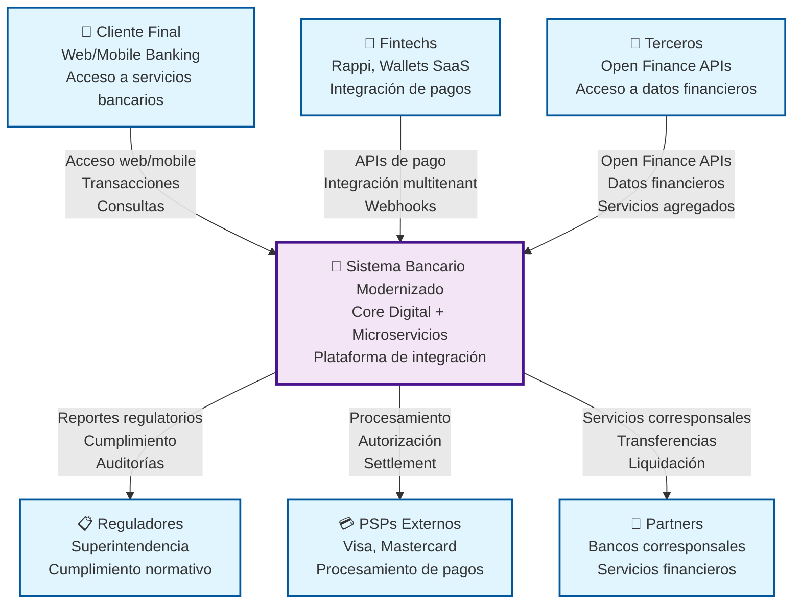

# Diagrama de Contexto C4 - Sistema Bancario Modernizado

## Descripción

Este diagrama muestra el **Sistema Bancario Modernizado** en el centro, interactuando con los principales actores externos del ecosistema financiero.

## Diagrama

## Actores Externos

### 👤 Cliente Final
- **Descripción**: Usuarios que acceden a servicios bancarios a través de web y mobile
- **Interacciones**: 
  - Acceso a cuentas bancarias
  - Realización de transacciones
  - Consultas de saldos y movimientos
  - Gestión de productos financieros

### 🏢 Fintechs
- **Descripción**: Empresas como Rappi que integran servicios de pago
- **Interacciones**:
  - Integración de APIs de pago
  - Procesamiento de transacciones multitenant
  - Recepción de webhooks de confirmación
  - Gestión de wallets digitales

### 🔗 Terceros
- **Descripción**: Proveedores que acceden a APIs de Open Finance
- **Interacciones**:
  - Acceso a datos financieros agregados
  - Servicios de agregación financiera
  - Análisis de comportamiento financiero
  - Desarrollo de aplicaciones financieras

### 📋 Reguladores
- **Descripción**: Superintendencias que requieren cumplimiento normativo
- **Interacciones**:
  - Recepción de reportes regulatorios
  - Auditorías de cumplimiento
  - Monitoreo de transacciones
  - Verificación de controles de seguridad

### 💳 PSPs Externos
- **Descripción**: Procesadores como Visa/Mastercard para pagos
- **Interacciones**:
  - Autorización de transacciones
  - Procesamiento de pagos
  - Settlement y liquidación
  - Gestión de disputas

### 🤝 Partners
- **Descripción**: Bancos corresponsales para servicios financieros
- **Interacciones**:
  - Servicios corresponsales
  - Transferencias internacionales
  - Liquidación de operaciones
  - Servicios de custodia

## Flujos Principales

### 1. Acceso de Clientes
- **Flujo**: Cliente → Sistema Bancario
- **Propósito**: Acceso a servicios bancarios digitales
- **Tecnología**: Web/Mobile Banking, APIs REST

### 2. Integración Fintech
- **Flujo**: Fintech → Sistema Bancario
- **Propósito**: Procesamiento de pagos multitenant
- **Tecnología**: APIs REST, Webhooks, OAuth 2.0

### 3. Open Finance
- **Flujo**: Terceros → Sistema Bancario
- **Propósito**: Acceso a datos financieros
- **Tecnología**: Open Finance APIs, OAuth 2.0

### 4. Cumplimiento
- **Flujo**: Sistema Bancario → Reguladores
- **Propósito**: Reportes y auditorías regulatorias
- **Tecnología**: APIs de reporte, SFTP

### 5. Procesamiento
- **Flujo**: Sistema Bancario ↔ PSPs
- **Propósito**: Autorización y settlement de pagos
- **Tecnología**: APIs de PSP, ISO 8583

### 6. Servicios Corresponsales
- **Flujo**: Sistema Bancario ↔ Partners
- **Propósito**: Servicios financieros internacionales
- **Tecnología**: SWIFT, APIs bancarias

## Consideraciones de Seguridad

- **Autenticación**: OAuth 2.0 + OpenID Connect
- **Autorización**: RBAC + ABAC
- **Cifrado**: TLS 1.3 en tránsito, AES-256 en reposo
- **Monitoreo**: Logging completo de todas las interacciones
- **Cumplimiento**: PCI DSS, GDPR, regulaciones bancarias locales

## Métricas y SLAs

| Actor | Disponibilidad | Latencia | Throughput |
|-------|---------------|----------|------------|
| Cliente Final | 99.9% | < 2s | 1000 req/s |
| Fintechs | 99.95% | < 1s | 5000 req/s |
| Terceros | 99.9% | < 3s | 1000 req/s |
| Reguladores | 99.99% | < 5s | 100 req/s |
| PSPs | 99.99% | < 500ms | 10000 req/s |
| Partners | 99.9% | < 2s | 1000 req/s |

---

**Documento**: Diagrama de Contexto C4  
**Versión**: 1.0  
**Fecha**: Diciembre 2024
