# Diagrama de Contenedores C4 - Arquitectura AWS

## Descripción

Este diagrama muestra la **arquitectura de contenedores** del sistema bancario modernizado, detallando los componentes principales, tecnologías AWS y sus interacciones.

## Diagrama

```mermaid
graph TB
    %% Frontend Layer
    WebApp[🌐 Web Banking<br/>React SPA<br/>S3 + CloudFront<br/>CDN Global]
    MobileApp[📱 Mobile Banking<br/>React Native<br/>iOS/Android<br/>Cross-platform]
    
    %% API Gateway Layer
    APIGateway[🚪 API Gateway<br/>AWS API Gateway<br/>Rate Limiting, Auth<br/>OAuth 2.0 + JWT]
    
    %% Microservicios Core
    UserService[👤 User Service<br/>ECS Fargate<br/>Cognito Integration<br/>Identity Management]
    AccountService[💰 Account Service<br/>ECS Fargate<br/>RDS PostgreSQL<br/>Account Management]
    PaymentService[💳 Payment Service<br/>ECS Fargate<br/>Multi-tenant<br/>PSP Integration]
    RiskService[⚠️ Risk Management<br/>ECS Fargate<br/>SageMaker ML<br/>Real-time Scoring]
    FraudService[🛡️ Fraud Prevention<br/>ECS Fargate<br/>Real-time Analysis<br/>ML Detection]
    NotificationService[📧 Notification Service<br/>Lambda Functions<br/>SNS + SES<br/>Multi-channel]
    
    %% Legacy Integration
    LegacyCore[🏛️ Legacy Core<br/>Monolito Existente<br/>Strangler Pattern<br/>Gradual Migration]
    
    %% External Services
    OpenFinanceAPI[🔌 Open Finance APIs<br/>Lambda Functions<br/>OAuth 2.0<br/>Third-party Access]
    
    %% Data Layer
    RDS[(🗄️ RDS PostgreSQL<br/>Multi-AZ<br/>Read Replicas<br/>Backup & Recovery)]
    DynamoDB[(📊 DynamoDB<br/>NoSQL<br/>Global Tables<br/>Auto-scaling)]
    S3[(📦 S3<br/>Documents, Logs<br/>Lifecycle Policies<br/>Encryption)]
    ElastiCache[(⚡ ElastiCache<br/>Redis<br/>Session Store<br/>Caching Layer)]
    
    %% Message Queue
    MSK[📨 Amazon MSK<br/>Kafka Cluster<br/>Event Streaming<br/>Real-time Processing]
    
    %% Monitoring & Security
    CloudWatch[📊 CloudWatch<br/>Monitoring & Logs<br/>Alarms & Dashboards<br/>Performance Metrics]
    WAF[🛡️ AWS WAF<br/>Web Application Firewall<br/>DDoS Protection<br/>Security Rules]
    
    %% External Integrations
    Cognito[🔐 Amazon Cognito<br/>User Pools<br/>Identity Federation<br/>MFA Support]
    KMS[🔑 AWS KMS<br/>Key Management<br/>Encryption Keys<br/>HSM Integration]
    
    %% Conexiones Frontend
    WebApp -->|HTTPS/TLS 1.3| APIGateway
    MobileApp -->|HTTPS/TLS 1.3| APIGateway
    
    %% Conexiones API Gateway
    APIGateway -->|OAuth 2.0| UserService
    APIGateway -->|JWT Token| AccountService
    APIGateway -->|Multi-tenant| PaymentService
    APIGateway -->|Rate Limited| OpenFinanceAPI
    
    %% Conexiones entre servicios
    UserService -->|REST API| AccountService
    PaymentService -->|Event Stream| RiskService
    PaymentService -->|Event Stream| FraudService
    RiskService -->|ML Models| FraudService
    PaymentService -->|Notifications| NotificationService
    
    %% Legacy Integration
    PaymentService -->|API Adapter| LegacyCore
    AccountService -->|Data Sync| LegacyCore
    
    %% Data Connections
    UserService -->|JDBC| RDS
    AccountService -->|JDBC| RDS
    PaymentService -->|DynamoDB SDK| DynamoDB
    RiskService -->|S3 SDK| S3
    FraudService -->|Redis Client| ElastiCache
    
    %% Message Queue Connections
    PaymentService -->|Kafka Producer| MSK
    RiskService -->|Kafka Consumer| MSK
    FraudService -->|Kafka Consumer| MSK
    NotificationService -->|Kafka Consumer| MSK
    
    %% Security & Auth
    APIGateway -->|User Auth| Cognito
    UserService -->|Identity| Cognito
    PaymentService -->|Encryption| KMS
    
    %% Monitoring
    UserService -->|Metrics| CloudWatch
    AccountService -->|Metrics| CloudWatch
    PaymentService -->|Metrics| CloudWatch
    RiskService -->|Metrics| CloudWatch
    FraudService -->|Metrics| CloudWatch
    
    %% Security
    APIGateway -->|Traffic Filter| WAF
    
    %% Estilos
    classDef frontend fill:#e8f5e8,stroke:#2e7d32,stroke-width:2px
    classDef microservice fill:#fff3e0,stroke:#ef6c00,stroke-width:2px
    classDef legacy fill:#ffebee,stroke:#c62828,stroke-width:2px
    classDef data fill:#e3f2fd,stroke:#1565c0,stroke-width:2px
    classDef messaging fill:#f3e5f5,stroke:#7b1fa2,stroke-width:2px
    classDef monitoring fill:#f1f8e9,stroke:#558b2f,stroke-width:2px
    classDef security fill:#fce4ec,stroke:#ad1457,stroke-width:2px
    
    class WebApp,MobileApp frontend
    class UserService,AccountService,PaymentService,RiskService,FraudService,NotificationService,OpenFinanceAPI microservice
    class LegacyCore legacy
    class RDS,DynamoDB,S3,ElastiCache data
    class MSK messaging
    class CloudWatch monitoring
    class WAF,Cognito,KMS security
```

## Capas de la Arquitectura

### 1. Frontend Layer
- **Web Banking**: React SPA con CDN global
- **Mobile Banking**: React Native cross-platform
- **Tecnologías**: S3, CloudFront, React, React Native

### 2. API Gateway Layer
- **AWS API Gateway**: Punto de entrada único
- **Características**: Rate limiting, autenticación, autorización
- **Protocolos**: OAuth 2.0, JWT, HTTPS/TLS 1.3

### 3. Microservicios Core
- **User Service**: Gestión de identidad y usuarios
- **Account Service**: Gestión de cuentas bancarias
- **Payment Service**: Procesamiento de pagos multitenant
- **Risk Service**: Evaluación de riesgos con ML
- **Fraud Service**: Detección de fraude en tiempo real
- **Notification Service**: Notificaciones multicanal

### 4. Legacy Integration
- **Legacy Core**: Monolito existente
- **Patrón**: Strangler Fig para migración gradual
- **Integración**: APIs adaptadoras y sincronización de datos

### 5. Data Layer
- **RDS PostgreSQL**: Datos transaccionales críticos
- **DynamoDB**: Datos de pagos y sesiones
- **S3**: Documentos y logs
- **ElastiCache**: Cache y sesiones

### 6. Messaging
- **Amazon MSK**: Event streaming con Kafka
- **Patrón**: Event-driven architecture
- **Procesamiento**: Real-time event processing

### 7. Security & Monitoring
- **AWS WAF**: Protección web
- **Cognito**: Gestión de identidad
- **KMS**: Gestión de claves
- **CloudWatch**: Monitoreo y alertas

## Tecnologías AWS Utilizadas

| Servicio | Propósito | Características |
|----------|-----------|-----------------|
| **ECS Fargate** | Orquestación de contenedores | Serverless, auto-scaling |
| **API Gateway** | Punto de entrada de APIs | Rate limiting, caching |
| **Lambda** | Funciones serverless | Notificaciones, Open Finance |
| **RDS PostgreSQL** | Base de datos relacional | Multi-AZ, read replicas |
| **DynamoDB** | Base de datos NoSQL | Global tables, auto-scaling |
| **S3** | Almacenamiento de objetos | Lifecycle policies, encryption |
| **ElastiCache** | Cache en memoria | Redis, session store |
| **MSK** | Event streaming | Kafka, real-time processing |
| **SageMaker** | Machine Learning | Modelos de riesgo y fraude |
| **Cognito** | Gestión de identidad | User pools, MFA |
| **KMS** | Gestión de claves | HSM, encryption |
| **CloudWatch** | Monitoreo | Metrics, logs, alarms |
| **WAF** | Protección web | DDoS, security rules |

## Patrones de Comunicación

### 1. Síncrona (REST APIs)
- **Frontend ↔ API Gateway**: HTTPS/TLS 1.3
- **API Gateway ↔ Microservicios**: OAuth 2.0 + JWT
- **Microservicios ↔ Legacy**: API adaptadoras

### 2. Asíncrona (Event Streaming)
- **Payment Service → MSK**: Eventos de pago
- **Risk Service ← MSK**: Consumo de eventos
- **Fraud Service ← MSK**: Consumo de eventos
- **Notification Service ← MSK**: Consumo de eventos

### 3. Base de Datos
- **User/Account Service → RDS**: JDBC
- **Payment Service → DynamoDB**: DynamoDB SDK
- **Risk Service → S3**: S3 SDK
- **Fraud Service → ElastiCache**: Redis Client

## Consideraciones de Seguridad

- **Cifrado en tránsito**: TLS 1.3
- **Cifrado en reposo**: AES-256
- **Autenticación**: OAuth 2.0 + OpenID Connect
- **Autorización**: RBAC + ABAC
- **Monitoreo**: CloudTrail + CloudWatch
- **Protección**: WAF + Shield

## Escalabilidad y Disponibilidad

- **Auto-scaling**: ECS Fargate, DynamoDB
- **Multi-AZ**: RDS, ECS
- **Load Balancing**: Application Load Balancer
- **Caching**: ElastiCache, API Gateway
- **CDN**: CloudFront

---

**Documento**: Diagrama de Contenedores C4  
**Versión**: 1.0  
**Fecha**: Diciembre 2024
