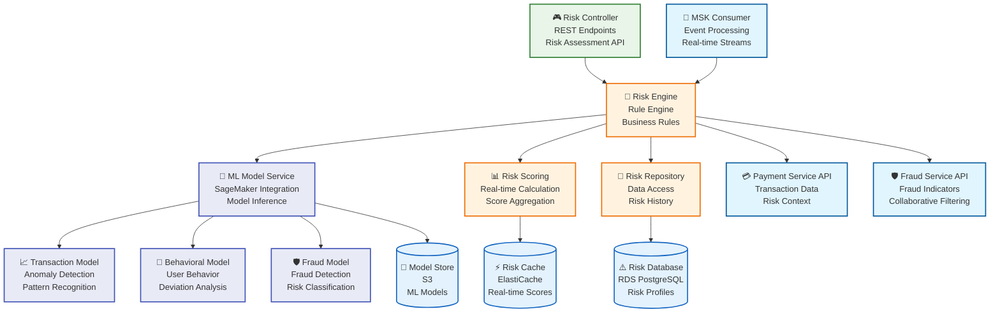
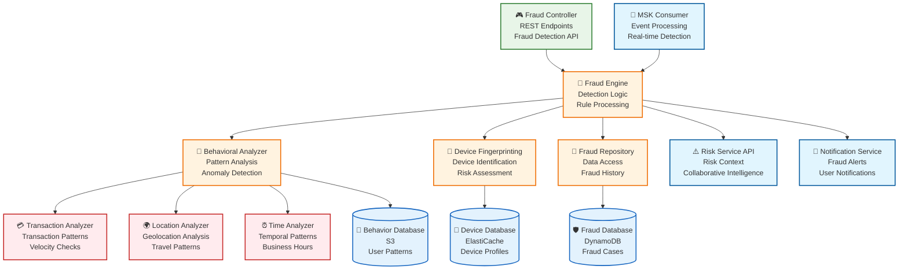

# Diagrama de Componentes C4 - Microservicios Detallados

## Descripción

Este diagrama muestra el **detalle interno de los microservicios críticos**, incluyendo componentes, dependencias y flujos de datos.

## 1. Payment Service (Basado en experiencia con cashier PSP)

```mermaid
graph TB
    %% Payment Service Components
    PaymentController[🎮 Payment Controller<br/>REST Endpoints<br/>Validation & Auth]
    PaymentOrchestrator[🎭 Payment Orchestrator<br/>Business Logic<br/>Transaction Flow]
    PSPAdapterResolver[🔌 PSP Adapter Resolver<br/>Provider Selection<br/>Multi-tenant Support]
    RiskEvaluator[⚠️ Risk Evaluator<br/>Real-time Assessment<br/>ML Integration]
    FraudDetector[🛡️ Fraud Detector<br/>ML Models<br/>Behavioral Analysis]
    TransactionRepo[💾 Transaction Repository<br/>Data Access<br/>Multi-tenant Queries]
    WebhookHandler[📡 Webhook Handler<br/>PSP Notifications<br/>Event Processing]
    
    %% PSP Adapters (Basado en tu código)
    BTGAdapter[🏦 BTG Adapter<br/>Brazilian Bank<br/>Payment Processing]
    TotalCoinAdapter[💰 TotalCoin Adapter<br/>Crypto Payments<br/>Multi-currency]
    MercadoPagoAdapter[💳 MercadoPago Adapter<br/>Latin America<br/>Digital Wallets]
    AstroPayAdapter[⭐ AstroPay Adapter<br/>Alternative Payments<br/>Local Methods]
    
    %% External Dependencies
    MSKQueue[📨 MSK Queue<br/>Event Publishing<br/>Kafka Topics]
    RiskServiceAPI[⚠️ Risk Service API<br/>External Call<br/>Risk Scoring]
    FraudServiceAPI[🛡️ Fraud Service API<br/>External Call<br/>Fraud Detection]
    NotificationService[📧 Notification Service<br/>Multi-channel<br/>SMS/Email/Push]
    
    %% Data Sources
    PaymentDB[(💳 Payment Database<br/>DynamoDB<br/>Multi-tenant)]
    Cache[(⚡ Redis Cache<br/>Session Data<br/>Rate Limiting)]
    AuditLogs[(📝 Audit Logs<br/>S3<br/>Compliance)]
    
    %% Flow
    PaymentController --> PaymentOrchestrator
    PaymentOrchestrator --> PSPAdapterResolver
    PaymentOrchestrator --> RiskEvaluator
    PaymentOrchestrator --> FraudDetector
    PaymentOrchestrator --> TransactionRepo
    PaymentOrchestrator --> WebhookHandler
    
    %% PSP Adapter Resolution
    PSPAdapterResolver --> BTGAdapter
    PSPAdapterResolver --> TotalCoinAdapter
    PSPAdapterResolver --> MercadoPagoAdapter
    PSPAdapterResolver --> AstroPayAdapter
    
    %% External Calls
    RiskEvaluator --> RiskServiceAPI
    FraudDetector --> FraudServiceAPI
    PaymentOrchestrator --> NotificationService
    
    %% Data Access
    TransactionRepo --> PaymentDB
    PaymentOrchestrator --> Cache
    WebhookHandler --> AuditLogs
    
    %% Event Publishing
    PaymentOrchestrator --> MSKQueue
    WebhookHandler --> MSKQueue
    
    %% Estilos
    classDef controller fill:#e8f5e8,stroke:#2e7d32,stroke-width:2px
    classDef business fill:#fff3e0,stroke:#ef6c00,stroke-width:2px
    classDef adapter fill:#f3e5f5,stroke:#7b1fa2,stroke-width:2px
    classDef external fill:#e1f5fe,stroke:#01579b,stroke-width:2px
    classDef data fill:#e3f2fd,stroke:#1565c0,stroke-width:2px
    
    class PaymentController controller
    class PaymentOrchestrator,RiskEvaluator,FraudDetector,TransactionRepo,WebhookHandler business
    class PSPAdapterResolver,BTGAdapter,TotalCoinAdapter,MercadoPagoAdapter,AstroPayAdapter adapter
    class MSKQueue,RiskServiceAPI,FraudServiceAPI,NotificationService external
    class PaymentDB,Cache,AuditLogs data
```

## 2. Risk Management Service

## 3. Fraud Prevention Service

## Descripción de los Componentes

### Payment Service (Basado en tu experiencia):

#### 🎮 Payment Controller
- **Responsabilidad**: Endpoints REST para procesamiento de pagos
- **Tecnología**: Spring Boot, REST APIs
- **Funcionalidades**: Validación, autenticación, rate limiting

#### 🎭 Payment Orchestrator
- **Responsabilidad**: Lógica de negocio y flujo de transacciones
- **Tecnología**: Spring Boot, Business Logic
- **Funcionalidades**: Orquestación de pagos, validaciones, eventos

#### 🔌 PSP Adapter Resolver
- **Responsabilidad**: Resolución de proveedores por tenant
- **Tecnología**: Spring Boot, Factory Pattern
- **Funcionalidades**: Selección de PSP, aislamiento por tenant

#### 📡 Webhook Handler
- **Responsabilidad**: Procesamiento de notificaciones de PSPs
- **Tecnología**: Spring Boot, Event Processing
- **Funcionalidades**: Recepción de webhooks, procesamiento de eventos

### Risk Management Service:

#### 🧠 Risk Engine
- **Responsabilidad**: Motor de reglas de riesgo
- **Tecnología**: Spring Boot, Rule Engine
- **Funcionalidades**: Evaluación de reglas, scoring de riesgo

#### 🤖 ML Model Service
- **Responsabilidad**: Integración con SageMaker para modelos ML
- **Tecnología**: AWS SageMaker SDK, Python
- **Funcionalidades**: Inferencia de modelos, predicción de riesgo

#### 📊 Risk Scoring
- **Responsabilidad**: Cálculo de scores de riesgo en tiempo real
- **Tecnología**: Spring Boot, Real-time Processing
- **Funcionalidades**: Agregación de scores, caching

### Fraud Prevention Service:

#### 🧠 Fraud Engine
- **Responsabilidad**: Motor de detección de fraude
- **Tecnología**: Spring Boot, ML Models
- **Funcionalidades**: Detección de patrones, clasificación de fraude

#### 👤 Behavioral Analyzer
- **Responsabilidad**: Análisis de patrones de comportamiento
- **Tecnología**: Spring Boot, ML Algorithms
- **Funcionalidades**: Análisis de comportamiento, detección de anomalías

#### 📱 Device Fingerprinting
- **Responsabilidad**: Identificación única de dispositivos
- **Tecnología**: Spring Boot, Device Analysis
- **Funcionalidades**: Fingerprinting, análisis de dispositivos

## Flujos de Datos

### 1. Flujo de Pago
1. **Payment Controller** recibe request
2. **Payment Orchestrator** valida y procesa
3. **Risk Evaluator** evalúa riesgo
4. **Fraud Detector** detecta fraude
5. **PSP Adapter Resolver** selecciona PSP
6. **PSP Adapter** procesa pago
7. **Transaction Repository** guarda transacción
8. **MSK Queue** publica evento

### 2. Flujo de Evaluación de Riesgo
1. **MSK Consumer** recibe evento
2. **Risk Engine** evalúa reglas
3. **ML Model Service** ejecuta modelos
4. **Risk Scoring** calcula score final
5. **Risk Repository** guarda evaluación
6. **Risk Cache** cachea resultado

### 3. Flujo de Detección de Fraude
1. **MSK Consumer** recibe evento
2. **Behavioral Analyzer** analiza comportamiento
3. **Device Fingerprinting** analiza dispositivo
4. **Fraud Engine** evalúa fraude
5. **Fraud Repository** guarda resultado
6. **Notification Service** envía alertas

## Consideraciones Técnicas

### Performance
- **Caching**: Redis para datos frecuentes
- **Async Processing**: Kafka para eventos
- **Database Optimization**: Índices y particionado
- **Load Balancing**: Distribución de carga

### Seguridad
- **Encryption**: AES-256 en reposo, TLS 1.3 en tránsito
- **Authentication**: OAuth 2.0 + JWT
- **Authorization**: RBAC + ABAC
- **Audit Logging**: Logs completos en S3

### Escalabilidad
- **Auto-scaling**: ECS Fargate
- **Database Scaling**: RDS read replicas, DynamoDB auto-scaling
- **Cache Scaling**: ElastiCache clusters
- **Message Scaling**: MSK partitions

---

**Documento**: Diagrama de Componentes C4  
**Versión**: 1.0  
**Fecha**: Diciembre 2024
