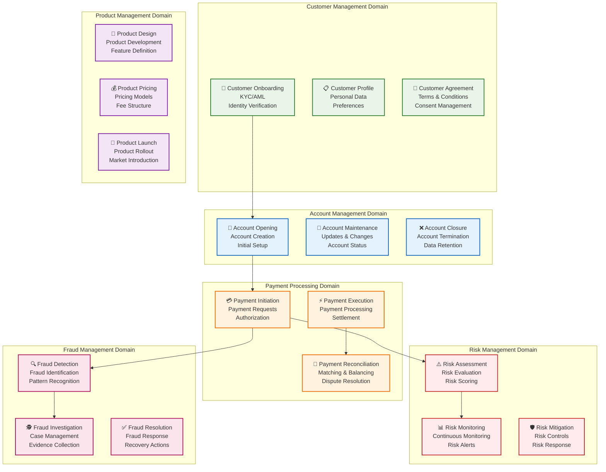

# Diagrama BIAN Service Landscape

## Descripción

Este diagrama muestra el **mapeo de la arquitectura bancaria a los estándares BIAN (Banking Industry Architecture Network)**, organizando los servicios por dominios de negocio y capacidades.

## Diagrama

## Mapeo BIAN a Microservicios

| BIAN Service Domain | Microservicio | Capacidades | Tecnología |
|---------------------|---------------|-------------|------------|
| **Customer Management** | User Service | Onboarding, Profile, Agreements | ECS Fargate, RDS |
| **Account Management** | Account Service | Opening, Maintenance, Closure | ECS Fargate, RDS |
| **Payment Processing** | Payment Service | Initiation, Execution, Reconciliation | ECS Fargate, DynamoDB |
| **Risk Management** | Risk Service | Assessment, Monitoring, Mitigation | ECS Fargate, SageMaker |
| **Fraud Management** | Fraud Service | Detection, Investigation, Resolution | ECS Fargate, SageMaker |
| **Product Management** | Product Service | Design, Pricing, Launch | ECS Fargate, RDS |

## Detalle de Dominios BIAN

### 1. Customer Management Domain

#### 👤 Customer Onboarding
- **Capacidades**:
  - Verificación de identidad (KYC)
  - Cumplimiento AML
  - Validación de documentos
  - Creación de perfil inicial
- **Microservicio**: User Service
- **APIs**:
  - `POST /api/v1/customers` - Crear cliente
  - `POST /api/v1/customers/{id}/kyc` - Verificar identidad
  - `POST /api/v1/customers/{id}/documents` - Subir documentos

#### 📋 Customer Profile
- **Capacidades**:
  - Gestión de datos personales
  - Preferencias del cliente
  - Historial de interacciones
  - Segmentación de clientes
- **Microservicio**: User Service
- **APIs**:
  - `GET /api/v1/customers/{id}` - Obtener perfil
  - `PUT /api/v1/customers/{id}` - Actualizar perfil
  - `GET /api/v1/customers/{id}/preferences` - Obtener preferencias

#### 📄 Customer Agreement
- **Capacidades**:
  - Gestión de términos y condiciones
  - Consentimiento de datos
  - Acuerdos de servicio
  - Políticas de privacidad
- **Microservicio**: User Service
- **APIs**:
  - `POST /api/v1/customers/{id}/agreements` - Crear acuerdo
  - `GET /api/v1/customers/{id}/agreements` - Obtener acuerdos
  - `PUT /api/v1/customers/{id}/consent` - Actualizar consentimiento

### 2. Account Management Domain

#### 🏦 Account Opening
- **Capacidades**:
  - Creación de cuentas
  - Configuración inicial
  - Asignación de productos
  - Activación de servicios
- **Microservicio**: Account Service
- **APIs**:
  - `POST /api/v1/accounts` - Crear cuenta
  - `POST /api/v1/accounts/{id}/activate` - Activar cuenta
  - `POST /api/v1/accounts/{id}/products` - Asignar productos

#### 🔧 Account Maintenance
- **Capacidades**:
  - Actualizaciones de cuenta
  - Cambios de estado
  - Modificaciones de límites
  - Gestión de servicios
- **Microservicio**: Account Service
- **APIs**:
  - `PUT /api/v1/accounts/{id}` - Actualizar cuenta
  - `PUT /api/v1/accounts/{id}/status` - Cambiar estado
  - `PUT /api/v1/accounts/{id}/limits` - Actualizar límites

#### ❌ Account Closure
- **Capacidades**:
  - Cierre de cuentas
  - Terminación de servicios
  - Retención de datos
  - Transferencia de saldos
- **Microservicio**: Account Service
- **APIs**:
  - `POST /api/v1/accounts/{id}/close` - Cerrar cuenta
  - `GET /api/v1/accounts/{id}/closure-status` - Estado de cierre
  - `POST /api/v1/accounts/{id}/transfer-balance` - Transferir saldo

### 3. Payment Processing Domain

#### 💳 Payment Initiation
- **Capacidades**:
  - Iniciación de pagos
  - Validación de solicitudes
  - Autorización previa
  - Gestión de límites
- **Microservicio**: Payment Service
- **APIs**:
  - `POST /api/v1/payments` - Crear pago
  - `POST /api/v1/payments/{id}/authorize` - Autorizar pago
  - `GET /api/v1/payments/{id}/status` - Estado del pago

#### ⚡ Payment Execution
- **Capacidades**:
  - Procesamiento de pagos
  - Integración con PSPs
  - Gestión de errores
  - Confirmaciones
- **Microservicio**: Payment Service
- **APIs**:
  - `POST /api/v1/payments/{id}/execute` - Ejecutar pago
  - `POST /api/v1/payments/{id}/retry` - Reintentar pago
  - `GET /api/v1/payments/{id}/confirmation` - Confirmación

#### 🔄 Payment Reconciliation
- **Capacidades**:
  - Conciliación de pagos
  - Matching de transacciones
  - Resolución de discrepancias
  - Reportes de liquidación
- **Microservicio**: Payment Service
- **APIs**:
  - `POST /api/v1/payments/reconcile` - Conciliar pagos
  - `GET /api/v1/payments/reconciliation-report` - Reporte de conciliación
  - `POST /api/v1/payments/{id}/dispute` - Crear disputa

### 4. Risk Management Domain

#### ⚠️ Risk Assessment
- **Capacidades**:
  - Evaluación de riesgos
  - Scoring de riesgo
  - Análisis de patrones
  - Clasificación de riesgo
- **Microservicio**: Risk Service
- **APIs**:
  - `POST /api/v1/risk/assess` - Evaluar riesgo
  - `GET /api/v1/risk/{id}/score` - Obtener score
  - `POST /api/v1/risk/{id}/classify` - Clasificar riesgo

#### 📊 Risk Monitoring
- **Capacidades**:
  - Monitoreo continuo
  - Alertas de riesgo
  - Dashboards de riesgo
  - Reportes de tendencias
- **Microservicio**: Risk Service
- **APIs**:
  - `GET /api/v1/risk/monitoring` - Monitoreo en tiempo real
  - `GET /api/v1/risk/alerts` - Alertas de riesgo
  - `GET /api/v1/risk/dashboard` - Dashboard de riesgo

#### 🛡️ Risk Mitigation
- **Capacidades**:
  - Controles de riesgo
  - Respuesta a riesgos
  - Mitigación de amenazas
  - Planes de contingencia
- **Microservicio**: Risk Service
- **APIs**:
  - `POST /api/v1/risk/{id}/mitigate` - Mitigar riesgo
  - `POST /api/v1/risk/{id}/control` - Aplicar control
  - `GET /api/v1/risk/{id}/mitigation-plan` - Plan de mitigación

### 5. Fraud Management Domain

#### 🔍 Fraud Detection
- **Capacidades**:
  - Detección de fraude
  - Identificación de patrones
  - Análisis de comportamiento
  - Alertas de fraude
- **Microservicio**: Fraud Service
- **APIs**:
  - `POST /api/v1/fraud/detect` - Detectar fraude
  - `GET /api/v1/fraud/{id}/analysis` - Análisis de fraude
  - `GET /api/v1/fraud/alerts` - Alertas de fraude

#### 🕵️ Fraud Investigation
- **Capacidades**:
  - Investigación de casos
  - Gestión de evidencias
  - Análisis forense
  - Reportes de investigación
- **Microservicio**: Fraud Service
- **APIs**:
  - `POST /api/v1/fraud/{id}/investigate` - Investigar caso
  - `POST /api/v1/fraud/{id}/evidence` - Agregar evidencia
  - `GET /api/v1/fraud/{id}/investigation-report` - Reporte de investigación

#### ✅ Fraud Resolution
- **Capacidades**:
  - Resolución de fraudes
  - Acciones de recuperación
  - Compensación a clientes
  - Cierre de casos
- **Microservicio**: Fraud Service
- **APIs**:
  - `POST /api/v1/fraud/{id}/resolve` - Resolver fraude
  - `POST /api/v1/fraud/{id}/compensate` - Compensar cliente
  - `POST /api/v1/fraud/{id}/close` - Cerrar caso

### 6. Product Management Domain

#### 🎨 Product Design
- **Capacidades**:
  - Diseño de productos
  - Desarrollo de características
  - Configuración de productos
  - Testing de productos
- **Microservicio**: Product Service
- **APIs**:
  - `POST /api/v1/products` - Crear producto
  - `PUT /api/v1/products/{id}/features` - Agregar características
  - `POST /api/v1/products/{id}/test` - Probar producto

#### 💰 Product Pricing
- **Capacidades**:
  - Modelos de precios
  - Estructura de tarifas
  - Promociones
  - Descuentos
- **Microservicio**: Product Service
- **APIs**:
  - `POST /api/v1/products/{id}/pricing` - Configurar precios
  - `POST /api/v1/products/{id}/promotions` - Crear promoción
  - `GET /api/v1/products/{id}/pricing` - Obtener precios

#### 🚀 Product Launch
- **Capacidades**:
  - Lanzamiento de productos
  - Rollout al mercado
  - Introducción de productos
  - Marketing de productos
- **Microservicio**: Product Service
- **APIs**:
  - `POST /api/v1/products/{id}/launch` - Lanzar producto
  - `GET /api/v1/products/{id}/launch-status` - Estado de lanzamiento
  - `POST /api/v1/products/{id}/market` - Introducir al mercado

## Flujos de Integración BIAN

### 1. Flujo de Onboarding
1. **Customer Onboarding** → Verificación de identidad
2. **Customer Profile** → Creación de perfil
3. **Customer Agreement** → Aceptación de términos
4. **Account Opening** → Creación de cuenta
5. **Product Assignment** → Asignación de productos

### 2. Flujo de Pago
1. **Payment Initiation** → Solicitud de pago
2. **Risk Assessment** → Evaluación de riesgo
3. **Fraud Detection** → Detección de fraude
4. **Payment Execution** → Procesamiento
5. **Payment Reconciliation** → Conciliación

### 3. Flujo de Gestión de Riesgo
1. **Risk Assessment** → Evaluación inicial
2. **Risk Monitoring** → Monitoreo continuo
3. **Risk Mitigation** → Aplicación de controles
4. **Fraud Detection** → Detección de fraude
5. **Fraud Investigation** → Investigación si es necesario

## Beneficios del Mapeo BIAN

### ✅ **Estandarización**
- Uso de estándares internacionales
- Interoperabilidad entre sistemas
- Mejores prácticas de la industria

### ✅ **Gobernanza**
- Estructura clara de servicios
- Responsabilidades definidas
- Métricas estandarizadas

### ✅ **Escalabilidad**
- Servicios modulares
- Capacidades reutilizables
- Arquitectura flexible

### ✅ **Cumplimiento**
- Alineación con regulaciones
- Mejores prácticas de seguridad
- Auditoría simplificada

---

**Documento**: Diagrama BIAN Service Landscape  
**Versión**: 1.0  
**Fecha**: Diciembre 2024
