# Patrones de Integración - Arquitectura Bancaria

## Descripción

Este documento detalla los **patrones de integración** utilizados en la arquitectura bancaria moderna, incluyendo Event-Driven Architecture, API Gateway Patterns, Circuit Breaker y Saga Pattern.

## 1. Event-Driven Architecture

```mermaid
graph TB
    %% Event Sources
    PaymentInitiated[💳 Payment Initiated<br/>Payment Service]
    RiskEvaluated[⚠️ Risk Evaluated<br/>Risk Service]
    FraudDetected[🛡️ Fraud Detected<br/>Fraud Service]
    AccountUpdated[💰 Account Updated<br/>Account Service]
    
    %% Event Bus
    MSK[📨 Amazon MSK<br/>Kafka Cluster<br/>Event Streaming]
    
    %% Event Consumers
    NotificationConsumer[📧 Notification Consumer<br/>Send Alerts]
    AuditConsumer[📝 Audit Consumer<br/>Log Events]
    AnalyticsConsumer[📊 Analytics Consumer<br/>Business Intelligence]
    ComplianceConsumer[📋 Compliance Consumer<br/>Regulatory Reporting]
    
    %% Event Flow
    PaymentInitiated --> MSK
    RiskEvaluated --> MSK
    FraudDetected --> MSK
    AccountUpdated --> MSK
    
    MSK --> NotificationConsumer
    MSK --> AuditConsumer
    MSK --> AnalyticsConsumer
    MSK --> ComplianceConsumer
    
    %% Estilos
    classDef event fill:#e8f5e8,stroke:#2e7d32,stroke-width:2px
    classDef bus fill:#f3e5f5,stroke:#7b1fa2,stroke-width:2px
    classDef consumer fill:#e3f2fd,stroke:#1565c0,stroke-width:2px
    
    class PaymentInitiated,RiskEvaluated,FraudDetected,AccountUpdated event
    class MSK bus
    class NotificationConsumer,AuditConsumer,AnalyticsConsumer,ComplianceConsumer consumer
```



### Características del Event-Driven Architecture

#### Eventos Principales
```yaml
events:
  payment-initiated:
    source: payment-service
    payload: {transaction_id, amount, currency, tenant_id}
    
  payment-completed:
    source: payment-service
    payload: {transaction_id, status, timestamp}
    
  risk-evaluated:
    source: risk-service
    payload: {transaction_id, risk_score, recommendations}
    
  fraud-detected:
    source: fraud-service
    payload: {transaction_id, fraud_score, action_taken}
```

#### Implementación con Kafka
```java
@Component
public class PaymentEventHandler {
    
    @KafkaListener(topics = "payment-events")
    public void handlePaymentEvent(PaymentEvent event) {
        switch (event.getType()) {
            case PAYMENT_INITIATED:
                riskService.evaluateRisk(event);
                break;
            case PAYMENT_COMPLETED:
                notificationService.sendConfirmation(event);
                break;
        }
    }
}
```

## 2. API Gateway Patterns

```mermaid
graph TB
    %% Clients
    WebApp[🌐 Web App<br/>React SPA]
    MobileApp[📱 Mobile App<br/>React Native]
    ThirdParty[🔗 Third Party<br/>Open Finance]
    
    %% API Gateway
    APIGateway[🚪 API Gateway<br/>AWS API Gateway]
    
    %% Gateway Features
    RateLimiting[⏱️ Rate Limiting<br/>Per Tenant/User]
    Authentication[🔐 Authentication<br/>OAuth 2.0 + JWT]
    Authorization[🛡️ Authorization<br/>RBAC + ABAC]
    Caching[⚡ Caching<br/>Response Caching]
    Monitoring[📊 Monitoring<br/>Metrics & Logs]
    
    %% Backend Services
    UserService[👤 User Service]
    AccountService[💰 Account Service]
    PaymentService[💳 Payment Service]
    RiskService[⚠️ Risk Service]
    
    %% Flow
    WebApp --> APIGateway
    MobileApp --> APIGateway
    ThirdParty --> APIGateway
    
    APIGateway --> RateLimiting
    APIGateway --> Authentication
    APIGateway --> Authorization
    APIGateway --> Caching
    APIGateway --> Monitoring
    
    APIGateway --> UserService
    APIGateway --> AccountService
    APIGateway --> PaymentService
    APIGateway --> RiskService
    
    %% Estilos
    classDef client fill:#e8f5e8,stroke:#2e7d32,stroke-width:2px
    classDef gateway fill:#fff3e0,stroke:#ef6c00,stroke-width:2px
    classDef feature fill:#e3f2fd,stroke:#1565c0,stroke-width:2px
    classDef service fill:#f3e5f5,stroke:#7b1fa2,stroke-width:2px
    
    class WebApp,MobileApp,ThirdParty client
    class APIGateway gateway
    class RateLimiting,Authentication,Authorization,Caching,Monitoring feature
    class UserService,AccountService,PaymentService,RiskService service
```



### Características del API Gateway

#### Rate Limiting por Tenant
```yaml
rate_limits:
  basic_plan:
    requests_per_minute: 100
    burst_capacity: 200
    
  premium_plan:
    requests_per_minute: 1000
    burst_capacity: 2000
    
  enterprise_plan:
    requests_per_minute: 10000
    burst_capacity: 20000
```

#### Autenticación y Autorización
```yaml
auth_flows:
  oauth2:
    grant_types: [authorization_code, client_credentials]
    scopes: [read, write, admin]
    
  openid_connect:
    issuer: "https://auth.bank.com"
    audiences: [api.bank.com]
    
  mfa:
    methods: [sms, totp, biometric]
    required_for: [high_amount_transactions, admin_operations]
```

## 3. Circuit Breaker Pattern

```mermaid
graph TB
    %% Client
    PaymentService[💳 Payment Service<br/>Client]
    
    %% Circuit Breaker
    CircuitBreaker[⚡ Circuit Breaker<br/>Resilience Pattern]
    
    %% External Services
    RiskService[⚠️ Risk Service<br/>External Call]
    FraudService[🛡️ Fraud Service<br/>External Call]
    NotificationService[📧 Notification Service<br/>External Call]
    
    %% Fallback Services
    RiskFallback[⚠️ Risk Fallback<br/>Default Risk Score]
    FraudFallback[🛡️ Fraud Fallback<br/>Basic Validation]
    NotificationFallback[📧 Notification Fallback<br/>Queue for Later]
    
    %% States
    Closed[🟢 Closed<br/>Normal Operation]
    Open[🔴 Open<br/>Service Down]
    HalfOpen[🟡 Half Open<br/>Testing Recovery]
    
    %% Flow
    PaymentService --> CircuitBreaker
    CircuitBreaker --> RiskService
    CircuitBreaker --> FraudService
    CircuitBreaker --> NotificationService
    
    CircuitBreaker --> RiskFallback
    CircuitBreaker --> FraudFallback
    CircuitBreaker --> NotificationFallback
    
    CircuitBreaker --> Closed
    CircuitBreaker --> Open
    CircuitBreaker --> HalfOpen
    
    %% Estilos
    classDef client fill:#e8f5e8,stroke:#2e7d32,stroke-width:2px
    classDef breaker fill:#fff3e0,stroke:#ef6c00,stroke-width:2px
    classDef service fill:#e3f2fd,stroke:#1565c0,stroke-width:2px
    classDef fallback fill:#ffebee,stroke:#c62828,stroke-width:2px
    classDef state fill:#f3e5f5,stroke:#7b1fa2,stroke-width:2px
    
    class PaymentService client
    class CircuitBreaker breaker
    class RiskService,FraudService,NotificationService service
    class RiskFallback,FraudFallback,NotificationFallback fallback
    class Closed,Open,HalfOpen state
```



### Implementación del Circuit Breaker

```java
@Component
public class PaymentServiceClient {
    
    @CircuitBreaker(name = "payment-service", fallbackMethod = "fallbackPayment")
    public PaymentResult processPayment(PaymentRequest request) {
        return paymentService.process(request);
    }
    
    public PaymentResult fallbackPayment(PaymentRequest request, Exception ex) {
        // Lógica de fallback
        return PaymentResult.builder()
            .status("PENDING")
            .message("Payment queued for processing")
            .build();
    }
}
```

## 4. Saga Pattern para Transacciones Distribuidas

```mermaid
graph TB
    %% Saga Orchestrator
    SagaOrchestrator[🎭 Saga Orchestrator<br/>Transaction Coordinator]
    
    %% Saga Steps
    Step1[1️⃣ Validate Payment<br/>Payment Service]
    Step2[2️⃣ Check Risk<br/>Risk Service]
    Step3[3️⃣ Detect Fraud<br/>Fraud Service]
    Step4[4️⃣ Update Account<br/>Account Service]
    Step5[5️⃣ Send Notification<br/>Notification Service]
    
    %% Compensation Steps
    Comp1[↩️ Cancel Payment<br/>Payment Service]
    Comp2[↩️ Revert Risk Check<br/>Risk Service]
    Comp3[↩️ Clear Fraud Flag<br/>Fraud Service]
    Comp4[↩️ Revert Account<br/>Account Service]
    Comp5[↩️ Cancel Notification<br/>Notification Service]
    
    %% Flow
    SagaOrchestrator --> Step1
    Step1 --> Step2
    Step2 --> Step3
    Step3 --> Step4
    Step4 --> Step5
    
    %% Compensation Flow
    Step1 -.->|Failure| Comp1
    Step2 -.->|Failure| Comp2
    Step3 -.->|Failure| Comp3
    Step4 -.->|Failure| Comp4
    Step5 -.->|Failure| Comp5
    
    %% Estilos
    classDef orchestrator fill:#fff3e0,stroke:#ef6c00,stroke-width:2px
    classDef step fill:#e8f5e8,stroke:#2e7d32,stroke-width:2px
    classDef compensation fill:#ffebee,stroke:#c62828,stroke-width:2px
    
    class SagaOrchestrator orchestrator
    class Step1,Step2,Step3,Step4,Step5 step
    class Comp1,Comp2,Comp3,Comp4,Comp5 compensation
```



### Implementación del Saga Pattern

```java
@Component
public class PaymentSagaOrchestrator {
    
    public PaymentResult executePaymentSaga(PaymentRequest request) {
        SagaContext context = new SagaContext();
        
        try {
            // Step 1: Validate Payment
            context.setPaymentId(validatePayment(request));
            
            // Step 2: Check Risk
            context.setRiskScore(checkRisk(request));
            
            // Step 3: Detect Fraud
            context.setFraudScore(detectFraud(request));
            
            // Step 4: Update Account
            updateAccount(request, context);
            
            // Step 5: Send Notification
            sendNotification(request, context);
            
            return PaymentResult.success(context);
            
        } catch (Exception e) {
            // Execute compensation
            compensate(context);
            throw new PaymentSagaException("Payment saga failed", e);
        }
    }
    
    private void compensate(SagaContext context) {
        if (context.getNotificationSent()) {
            cancelNotification(context);
        }
        if (context.getAccountUpdated()) {
            revertAccount(context);
        }
        if (context.getFraudChecked()) {
            clearFraudFlag(context);
        }
        if (context.getRiskChecked()) {
            revertRiskCheck(context);
        }
        if (context.getPaymentValidated()) {
            cancelPayment(context);
        }
    }
}
```

## 5. Patrones de Comunicación

### 5.1 Síncrona (Request-Response)

#### REST APIs
```java
@RestController
@RequestMapping("/api/v1/payments")
public class PaymentController {
    
    @PostMapping
    public ResponseEntity<PaymentResponse> createPayment(
            @Valid @RequestBody PaymentRequest request) {
        
        PaymentResult result = paymentService.processPayment(request);
        return ResponseEntity.ok(PaymentResponse.from(result));
    }
}
```

#### GraphQL APIs
```graphql
type Query {
  payment(id: ID!): Payment
  payments(filter: PaymentFilter): [Payment]
}

type Mutation {
  createPayment(input: PaymentInput!): PaymentResult
  updatePayment(id: ID!, input: PaymentInput!): PaymentResult
}
```

### 5.2 Asíncrona (Event-Driven)

#### Message Queues
```java
@Component
public class PaymentEventProducer {
    
    @Autowired
    private KafkaTemplate<String, Object> kafkaTemplate;
    
    public void publishPaymentEvent(PaymentEvent event) {
        kafkaTemplate.send("payment-events", event);
    }
}
```

#### Webhooks
```java
@RestController
@RequestMapping("/webhooks")
public class WebhookController {
    
    @PostMapping("/payment-confirmation")
    public ResponseEntity<String> handlePaymentConfirmation(
            @RequestBody PaymentConfirmation confirmation) {
        
        webhookService.processConfirmation(confirmation);
        return ResponseEntity.ok("OK");
    }
}
```

## 6. Patrones de Resilencia

### 6.1 Retry Pattern
```java
@Retryable(value = {Exception.class}, maxAttempts = 3, backoff = @Backoff(delay = 1000))
public PaymentResult processPayment(PaymentRequest request) {
    return paymentService.process(request);
}
```

### 6.2 Timeout Pattern
```java
@Timeout(value = 5, unit = TimeUnit.SECONDS)
public PaymentResult processPayment(PaymentRequest request) {
    return paymentService.process(request);
}
```

### 6.3 Bulkhead Pattern
```java
@Configuration
public class ThreadPoolConfig {
    
    @Bean
    public Executor paymentExecutor() {
        ThreadPoolTaskExecutor executor = new ThreadPoolTaskExecutor();
        executor.setCorePoolSize(10);
        executor.setMaxPoolSize(20);
        executor.setQueueCapacity(100);
        executor.setThreadNamePrefix("payment-");
        return executor;
    }
}
```

## 7. Patrones de Seguridad

### 7.1 API Key Pattern
```java
@Component
public class ApiKeyAuthenticationFilter implements Filter {
    
    @Override
    public void doFilter(ServletRequest request, ServletResponse response, 
                        FilterChain chain) throws IOException, ServletException {
        
        String apiKey = extractApiKey(request);
        if (validateApiKey(apiKey)) {
            chain.doFilter(request, response);
        } else {
            ((HttpServletResponse) response).setStatus(HttpStatus.UNAUTHORIZED.value());
        }
    }
}
```

### 7.2 JWT Token Pattern
```java
@Component
public class JwtTokenProvider {
    
    public String generateToken(UserDetails userDetails) {
        return Jwts.builder()
            .setSubject(userDetails.getUsername())
            .setIssuedAt(new Date())
            .setExpiration(new Date(System.currentTimeMillis() + 86400000))
            .signWith(SignatureAlgorithm.HS512, secret)
            .compact();
    }
}
```

## 8. Patrones de Monitoreo

### 8.1 Health Check Pattern
```java
@Component
public class PaymentServiceHealthIndicator implements HealthIndicator {
    
    @Override
    public Health health() {
        try {
            // Check service health
            boolean isHealthy = checkServiceHealth();
            return isHealthy ? Health.up().build() : Health.down().build();
        } catch (Exception e) {
            return Health.down(e).build();
        }
    }
}
```

### 8.2 Metrics Pattern
```java
@Component
public class PaymentMetrics {
    
    private final MeterRegistry meterRegistry;
    private final Counter paymentCounter;
    private final Timer paymentTimer;
    
    public PaymentMetrics(MeterRegistry meterRegistry) {
        this.meterRegistry = meterRegistry;
        this.paymentCounter = Counter.builder("payments.total")
            .description("Total number of payments")
            .register(meterRegistry);
        this.paymentTimer = Timer.builder("payments.duration")
            .description("Payment processing duration")
            .register(meterRegistry);
    }
}
```

## Beneficios de los Patrones

### ✅ **Resilencia**
- Tolerancia a fallos
- Recuperación automática
- Degradación elegante

### ✅ **Escalabilidad**
- Distribución de carga
- Procesamiento paralelo
- Auto-scaling

### ✅ **Mantenibilidad**
- Código modular
- Separación de responsabilidades
- Testing simplificado

### ✅ **Observabilidad**
- Monitoreo completo
- Logging estructurado
- Métricas detalladas

---

**Documento**: Patrones de Integración  
**Versión**: 1.0  
**Fecha**: Diciembre 2024
