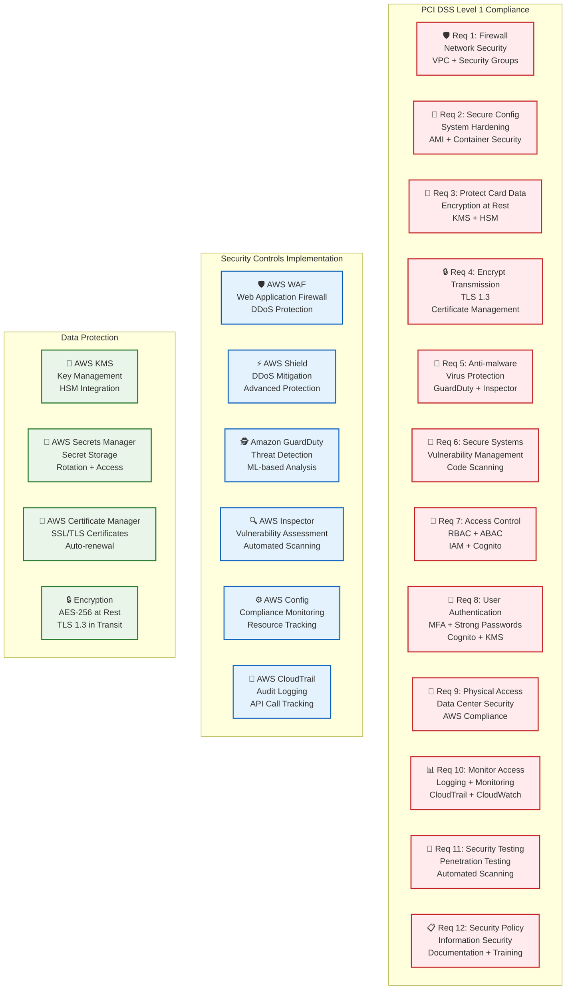
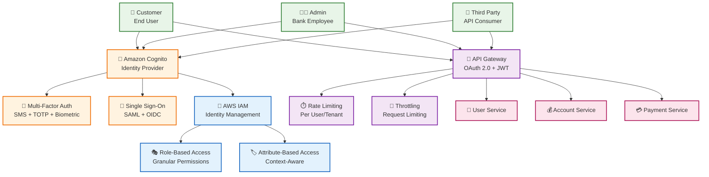

# Arquitectura de Seguridad - Cumplimiento PCI DSS

## Descripción

Este documento detalla la **arquitectura de seguridad** implementada para cumplir con estándares PCI DSS Level 1, incluyendo controles de seguridad, gestión de identidad y acceso, y protección de datos.

## 1. Cumplimiento PCI DSS



### Requisitos PCI DSS Implementados

| Requisito | Implementación | Tecnología AWS | Estado |
|-----------|----------------|----------------|--------|
| **Req 1**: Firewall | VPC + Security Groups | VPC, Security Groups, NACLs | ✅ |
| **Req 2**: Configuración Segura | Hardening de sistemas | AMI, Container Security | ✅ |
| **Req 3**: Protección de Datos | Cifrado en reposo | KMS, HSM | ✅ |
| **Req 4**: Cifrado en Tránsito | TLS 1.3 | Certificate Manager | ✅ |
| **Req 5**: Anti-malware | Protección contra virus | GuardDuty, Inspector | ✅ |
| **Req 6**: Sistemas Seguros | Gestión de vulnerabilidades | Code Scanning, Inspector | ✅ |
| **Req 7**: Control de Acceso | RBAC + ABAC | IAM, Cognito | ✅ |
| **Req 8**: Autenticación | MFA + Contraseñas fuertes | Cognito, KMS | ✅ |
| **Req 9**: Acceso Físico | Seguridad del centro de datos | AWS Compliance | ✅ |
| **Req 10**: Monitoreo | Logging + Monitoreo | CloudTrail, CloudWatch | ✅ |
| **Req 11**: Pruebas de Seguridad | Penetration Testing | Automated Scanning | ✅ |
| **Req 12**: Política de Seguridad | Seguridad de la información | Documentación + Training | ✅ |

## 2. Identity and Access Management



### Implementación de IAM

#### Roles y Permisos
```yaml
roles:
  customer:
    permissions: [read_account, create_payment, view_transactions]
    resources: [own_accounts, own_payments]
    
  admin:
    permissions: [read_all_accounts, manage_users, view_audit_logs]
    resources: [all_accounts, all_users, audit_logs]
    
  third_party:
    permissions: [read_aggregated_data, create_payment]
    resources: [aggregated_data, payment_apis]
```

#### Políticas de Acceso
```json
{
  "Version": "2012-10-17",
  "Statement": [
    {
      "Effect": "Allow",
      "Action": [
        "dynamodb:GetItem",
        "dynamodb:PutItem"
      ],
      "Resource": "arn:aws:dynamodb:region:account:table/payments",
      "Condition": {
        "StringEquals": {
          "dynamodb:Attributes": "tenant_id"
        }
      }
    }
  ]
}
```

## 3. Protección de Datos

### 3.1 Cifrado en Reposo

#### Implementación con KMS
```java
@Service
public class EncryptionService {
    
    @Autowired
    private KmsClient kmsClient;
    
    public String encryptData(String data, String keyId) {
        EncryptRequest request = EncryptRequest.builder()
            .keyId(keyId)
            .plaintext(SdkBytes.fromUtf8String(data))
            .build();
            
        EncryptResponse response = kmsClient.encrypt(request);
        return Base64.getEncoder().encodeToString(
            response.ciphertextBlob().asByteArray());
    }
    
    public String decryptData(String encryptedData, String keyId) {
        DecryptRequest request = DecryptRequest.builder()
            .keyId(keyId)
            .ciphertextBlob(SdkBytes.fromByteArray(
                Base64.getDecoder().decode(encryptedData)))
            .build();
            
        DecryptResponse response = kmsClient.decrypt(request);
        return response.plaintext().asUtf8String();
    }
}
```

### 3.2 Cifrado en Tránsito

#### Configuración TLS 1.3
```yaml
server:
  ssl:
    enabled: true
    protocol: TLSv1.3
    ciphers: TLS_AES_256_GCM_SHA384,TLS_CHACHA20_POLY1305_SHA256
    key-store: classpath:keystore.p12
    key-store-password: ${SSL_KEYSTORE_PASSWORD}
    key-store-type: PKCS12
```

### 3.3 Gestión de Secretos

#### AWS Secrets Manager
```java
@Service
public class SecretService {
    
    @Autowired
    private SecretsManagerClient secretsManagerClient;
    
    public String getSecret(String secretName) {
        GetSecretValueRequest request = GetSecretValueRequest.builder()
            .secretId(secretName)
            .build();
            
        GetSecretValueResponse response = secretsManagerClient.getSecretValue(request);
        return response.secretString();
    }
    
    public void rotateSecret(String secretName) {
        UpdateSecretRequest request = UpdateSecretRequest.builder()
            .secretId(secretName)
            .generateRandomPassword(true)
            .build();
            
        secretsManagerClient.updateSecret(request);
    }
}
```

## 4. Monitoreo y Auditoría

### 4.1 CloudTrail Logging

#### Configuración de Auditoría
```yaml
cloudtrail:
  enabled: true
  log_group: /aws/cloudtrail/banking-system
  log_retention: 2555 # 7 years
  events:
    - DataRead
    - DataWrite
    - Management
    - Insight
```

#### Implementación de Logging
```java
@Component
public class AuditLogger {
    
    private static final Logger auditLogger = LoggerFactory.getLogger("AUDIT");
    
    public void logDataAccess(String userId, String resource, String action) {
        AuditEvent event = AuditEvent.builder()
            .userId(userId)
            .resource(resource)
            .action(action)
            .timestamp(Instant.now())
            .build();
            
        auditLogger.info("Data access: {}", event);
    }
    
    public void logDataModification(String userId, String resource, 
                                   String action, String oldValue, String newValue) {
        AuditEvent event = AuditEvent.builder()
            .userId(userId)
            .resource(resource)
            .action(action)
            .oldValue(oldValue)
            .newValue(newValue)
            .timestamp(Instant.now())
            .build();
            
        auditLogger.info("Data modification: {}", event);
    }
}
```

### 4.2 CloudWatch Monitoring

#### Métricas de Seguridad
```java
@Component
public class SecurityMetrics {
    
    private final MeterRegistry meterRegistry;
    private final Counter failedLoginCounter;
    private final Counter suspiciousActivityCounter;
    
    public SecurityMetrics(MeterRegistry meterRegistry) {
        this.meterRegistry = meterRegistry;
        this.failedLoginCounter = Counter.builder("security.failed_logins")
            .description("Number of failed login attempts")
            .register(meterRegistry);
        this.suspiciousActivityCounter = Counter.builder("security.suspicious_activity")
            .description("Number of suspicious activities detected")
            .register(meterRegistry);
    }
    
    public void recordFailedLogin(String userId) {
        failedLoginCounter.increment(
            Tags.of("user_id", userId, "timestamp", Instant.now().toString()));
    }
    
    public void recordSuspiciousActivity(String activityType) {
        suspiciousActivityCounter.increment(
            Tags.of("activity_type", activityType));
    }
}
```

## 5. Detección de Amenazas

### 5.1 GuardDuty

#### Configuración de Detección
```yaml
guardduty:
  enabled: true
  data_sources:
    - CloudTrail
    - VPC Flow Logs
    - DNS Logs
    - S3 Access Logs
  findings:
    - High
    - Medium
    - Low
  notifications:
    - SNS
    - Slack
```

### 5.2 WAF Rules

#### Reglas de Protección
```yaml
waf_rules:
  - name: "SQL Injection Protection"
    priority: 1
    action: "BLOCK"
    conditions:
      - sql_injection_match
    
  - name: "XSS Protection"
    priority: 2
    action: "BLOCK"
    conditions:
      - xss_match
    
  - name: "Rate Limiting"
    priority: 3
    action: "BLOCK"
    conditions:
      - rate_limit: 1000
      - time_window: 300
```

## 6. Cumplimiento Regulatorio

### 6.1 GDPR/LOPD

#### Implementación de Derechos
```java
@Service
public class DataProtectionService {
    
    public void handleDataSubjectRequest(String userId, DataSubjectRequest request) {
        switch (request.getType()) {
            case ACCESS:
                provideDataAccess(userId);
                break;
            case RECTIFICATION:
                rectifyData(userId, request.getData());
                break;
            case ERASURE:
                eraseData(userId);
                break;
            case PORTABILITY:
                exportData(userId);
                break;
        }
    }
    
    private void provideDataAccess(String userId) {
        // Implementar derecho de acceso
        List<PersonalData> data = dataRepository.findByUserId(userId);
        // Enviar datos al usuario
    }
    
    private void eraseData(String userId) {
        // Implementar derecho al olvido
        dataRepository.deleteByUserId(userId);
        auditLogger.logDataErasure(userId);
    }
}
```

### 6.2 Basel III

#### Implementación de Controles
```java
@Service
public class BaselIIIService {
    
    public RiskWeight calculateRiskWeight(Asset asset) {
        // Implementar cálculo de ponderación de riesgo
        return RiskWeight.builder()
            .assetType(asset.getType())
            .riskWeight(calculateWeight(asset))
            .build();
    }
    
    public CapitalRatio calculateCapitalRatio(Bank bank) {
        // Implementar cálculo de ratio de capital
        BigDecimal tier1Capital = bank.getTier1Capital();
        BigDecimal riskWeightedAssets = bank.getRiskWeightedAssets();
        
        return CapitalRatio.builder()
            .tier1Ratio(tier1Capital.divide(riskWeightedAssets, 4, RoundingMode.HALF_UP))
            .build();
    }
}
```

## 7. Plan de Respuesta a Incidentes

### 7.1 Clasificación de Incidentes

| Severidad | Descripción | Tiempo de Respuesta | Escalación |
|-----------|-------------|-------------------|------------|
| **Crítica** | Brecha de datos, sistema comprometido | 15 minutos | CISO, CEO |
| **Alta** | Intrusión detectada, servicio comprometido | 1 hora | CISO, CTO |
| **Media** | Vulnerabilidad, intento de intrusión | 4 horas | Security Team |
| **Baja** | Alerta de seguridad, actividad sospechosa | 24 horas | Security Team |

### 7.2 Procedimientos de Respuesta

```java
@Service
public class IncidentResponseService {
    
    public void handleSecurityIncident(SecurityIncident incident) {
        // 1. Clasificar incidente
        IncidentSeverity severity = classifyIncident(incident);
        
        // 2. Activar equipo de respuesta
        activateResponseTeam(severity);
        
        // 3. Contener amenaza
        containThreat(incident);
        
        // 4. Investigar incidente
        investigateIncident(incident);
        
        // 5. Recuperar servicios
        recoverServices(incident);
        
        // 6. Documentar lecciones aprendidas
        documentLessonsLearned(incident);
    }
}
```

## 8. Testing de Seguridad

### 8.1 Penetration Testing

#### Herramientas Utilizadas
- **OWASP ZAP**: Testing de aplicaciones web
- **Nessus**: Escaneo de vulnerabilidades
- **Burp Suite**: Testing de APIs
- **Metasploit**: Testing de penetración

### 8.2 Code Security Scanning

#### Implementación con SonarQube
```yaml
sonarqube:
  enabled: true
  rules:
    - java:S2070 # SQL Injection
    - java:S2083 # XSS
    - java:S2078 # Path Traversal
    - java:S2089 # HTTP Response Splitting
  quality_gate:
    - security_hotspots: 0
    - vulnerabilities: 0
    - code_smells: 100
```

## Beneficios de la Arquitectura de Seguridad

### ✅ **Cumplimiento**
- PCI DSS Level 1 compliance
- GDPR/LOPD compliance
- Basel III compliance
- ISO 27001 compliance

### ✅ **Protección**
- Cifrado end-to-end
- Detección de amenazas
- Monitoreo continuo
- Respuesta automática

### ✅ **Auditoría**
- Logging completo
- Trazabilidad total
- Reportes automáticos
- Evidencia de cumplimiento

### ✅ **Resilencia**
- Tolerancia a fallos
- Recuperación rápida
- Continuidad del negocio
- Planes de contingencia

---

**Documento**: Arquitectura de Seguridad  
**Versión**: 1.0  
**Fecha**: Diciembre 2024


