# Alta Disponibilidad y Disaster Recovery

## Descripción

Este documento detalla la **estrategia de alta disponibilidad y disaster recovery** implementada para garantizar 99.99% de uptime y recuperación rápida ante desastres.

## 1. Estrategia Multi-Región

```mermaid
graph TB
    %% Regions
    subgraph "Primary Region - us-east-1"
        PrimaryAZ1[🏢 Availability Zone 1<br/>Active Services<br/>Primary Database]
        PrimaryAZ2[🏢 Availability Zone 2<br/>Active Services<br/>Read Replicas]
        PrimaryAZ3[🏢 Availability Zone 3<br/>Active Services<br/>Backup Services]
    end
    
    subgraph "Secondary Region - us-west-2"
        SecondaryAZ1[🏢 Availability Zone 1<br/>Standby Services<br/>Replica Database]
        SecondaryAZ2[🏢 Availability Zone 2<br/>Standby Services<br/>Backup Services]
        SecondaryAZ3[🏢 Availability Zone 3<br/>Standby Services<br/>Disaster Recovery]
    end
    
    subgraph "Backup Region - eu-west-1"
        BackupAZ1[🏢 Availability Zone 1<br/>Backup Services<br/>Data Archive]
        BackupAZ2[🏢 Availability Zone 2<br/>Backup Services<br/>Long-term Storage]
    end
    
    %% Load Balancer
    ALB[⚖️ Application Load Balancer<br/>Multi-AZ Distribution<br/>Health Checks]
    
    %% Database
    RDS[🗄️ RDS Multi-AZ<br/>Primary + Standby<br/>Automatic Failover]
    
    %% Data Replication
    DataSync[🔄 Data Synchronization<br/>Cross-Region Replication<br/>Real-time Sync]
    
    %% Monitoring
    CloudWatch[📊 CloudWatch<br/>Health Monitoring<br/>Automated Alerts]
    
    %% Failover
    Route53[🌐 Route 53<br/>DNS Failover<br/>Health-based Routing]
    
    %% Flow
    ALB --> PrimaryAZ1
    ALB --> PrimaryAZ2
    ALB --> PrimaryAZ3
    
    PrimaryAZ1 --> RDS
    PrimaryAZ2 --> RDS
    PrimaryAZ3 --> RDS
    
    RDS --> DataSync
    DataSync --> SecondaryAZ1
    DataSync --> SecondaryAZ2
    DataSync --> SecondaryAZ3
    
    DataSync --> BackupAZ1
    DataSync --> BackupAZ2
    
    CloudWatch --> ALB
    CloudWatch --> RDS
    CloudWatch --> Route53
    
    Route53 --> ALB
    
    %% Estilos
    classDef primary fill:#e8f5e8,stroke:#2e7d32,stroke-width:2px
    classDef secondary fill:#fff3e0,stroke:#ef6c00,stroke-width:2px
    classDef backup fill:#e3f2fd,stroke:#1565c0,stroke-width:2px
    classDef infra fill:#f3e5f5,stroke:#7b1fa2,stroke-width:2px
    classDef monitoring fill:#fce4ec,stroke:#ad1457,stroke-width:2px
    
    class PrimaryAZ1,PrimaryAZ2,PrimaryAZ3 primary
    class SecondaryAZ1,SecondaryAZ2,SecondaryAZ3 secondary
    class BackupAZ1,BackupAZ2 backup
    class ALB,RDS,DataSync,Route53 infra
    class CloudWatch monitoring
```



### Configuración de Regiones

| Región | Propósito | Disponibilidad | Latencia |
|--------|-----------|----------------|----------|
| **us-east-1** | Región Primaria | 99.99% | < 50ms |
| **us-west-2** | Región Secundaria | 99.95% | < 100ms |
| **eu-west-1** | Región de Backup | 99.9% | < 200ms |

## 2. Disaster Recovery Plan

```mermaid
graph TB
    %% DR Scenarios
    subgraph "Disaster Scenarios"
        Scenario1[🔥 Complete Region Failure<br/>Natural Disaster<br/>Infrastructure Outage]
        Scenario2[💥 Partial Service Failure<br/>Database Corruption<br/>Service Degradation]
        Scenario3[🔒 Security Breach<br/>Data Compromise<br/>Service Shutdown]
    end
    
    %% DR Procedures
    subgraph "Recovery Procedures"
        Detection[🔍 Detection<br/>Automated Monitoring<br/>Alert Systems]
        Assessment[📊 Assessment<br/>Impact Analysis<br/>Recovery Time Estimation]
        Activation[⚡ Activation<br/>Failover Procedures<br/>Service Restoration]
        Validation[✅ Validation<br/>Data Integrity<br/>Service Verification]
        Communication[📢 Communication<br/>Stakeholder Notification<br/>Status Updates]
    end
    
    %% Recovery Time Objectives
    subgraph "RTO/RPO Targets"
        RTO[⏱️ RTO: 4 Hours<br/>Recovery Time Objective<br/>Service Restoration]
        RPO[📊 RPO: 15 Minutes<br/>Recovery Point Objective<br/>Data Loss Tolerance]
    end
    
    %% Backup Strategies
    subgraph "Backup Strategies"
        Continuous[🔄 Continuous Backup<br/>Real-time Replication<br/>Cross-region Sync]
        Scheduled[📅 Scheduled Backup<br/>Daily Snapshots<br/>Point-in-time Recovery]
        Archive[📦 Long-term Archive<br/>S3 Glacier<br/>Compliance Storage]
    end
    
    %% Flow
    Scenario1 --> Detection
    Scenario2 --> Detection
    Scenario3 --> Detection
    
    Detection --> Assessment
    Assessment --> Activation
    Activation --> Validation
    Validation --> Communication
    
    Assessment --> RTO
    Assessment --> RPO
    
    Activation --> Continuous
    Activation --> Scheduled
    Activation --> Archive
    
    %% Estilos
    classDef scenario fill:#ffebee,stroke:#c62828,stroke-width:2px
    classDef procedure fill:#e3f2fd,stroke:#1565c0,stroke-width:2px
    classDef target fill:#fff3e0,stroke:#ef6c00,stroke-width:2px
    classDef backup fill:#e8f5e8,stroke:#2e7d32,stroke-width:2px
    
    class Scenario1,Scenario2,Scenario3 scenario
    class Detection,Assessment,Activation,Validation,Communication procedure
    class RTO,RPO target
    class Continuous,Scheduled,Archive backup
```



### Objetivos de Recuperación

| Servicio | RTO | RPO | Disponibilidad |
|----------|-----|-----|----------------|
| **Payment Service** | 2 horas | 5 minutos | 99.99% |
| **Account Service** | 4 horas | 15 minutos | 99.99% |
| **Risk Service** | 6 horas | 30 minutos | 99.95% |
| **Fraud Service** | 4 horas | 15 minutos | 99.95% |
| **User Service** | 2 horas | 5 minutos | 99.99% |

## 3. Implementación de Alta Disponibilidad

### 3.1 Load Balancing

#### Application Load Balancer
```yaml
alb:
  name: banking-alb
  scheme: internet-facing
  type: application
  subnets:
    - subnet-12345678
    - subnet-87654321
  security_groups:
    - sg-12345678
  target_groups:
    - name: payment-service-tg
      port: 8080
      protocol: HTTP
      health_check:
        path: /health
        interval: 30
        timeout: 5
        healthy_threshold: 2
        unhealthy_threshold: 3
```

#### Health Checks
```java
@Component
public class HealthCheckController {
    
    @GetMapping("/health")
    public ResponseEntity<HealthStatus> health() {
        HealthStatus status = HealthStatus.builder()
            .status("UP")
            .timestamp(Instant.now())
            .checks(performHealthChecks())
            .build();
            
        return ResponseEntity.ok(status);
    }
    
    private List<HealthCheck> performHealthChecks() {
        return Arrays.asList(
            checkDatabase(),
            checkRedis(),
            checkKafka(),
            checkExternalServices()
        );
    }
}
```

### 3.2 Auto Scaling

#### ECS Auto Scaling
```yaml
ecs_service:
  name: payment-service
  cluster: banking-cluster
  task_definition: payment-service:latest
  desired_count: 3
  deployment_configuration:
    maximum_percent: 200
    minimum_healthy_percent: 50
  auto_scaling:
    min_capacity: 2
    max_capacity: 10
    target_capacity: 5
    scaling_policies:
      - metric: CPUUtilization
        target_value: 70
        scale_out_cooldown: 300
        scale_in_cooldown: 300
      - metric: MemoryUtilization
        target_value: 80
        scale_out_cooldown: 300
        scale_in_cooldown: 300
```

### 3.3 Database High Availability

#### RDS Multi-AZ
```yaml
rds:
  engine: postgres
  engine_version: "13.7"
  instance_class: db.r5.large
  multi_az: true
  backup_retention_period: 30
  backup_window: "03:00-04:00"
  maintenance_window: "sun:04:00-sun:05:00"
  read_replicas:
    - region: us-west-2
      instance_class: db.r5.large
    - region: eu-west-1
      instance_class: db.r5.large
```

#### DynamoDB Global Tables
```yaml
dynamodb:
  table_name: payments
  billing_mode: PAY_PER_REQUEST
  global_tables:
    - region: us-east-1
    - region: us-west-2
    - region: eu-west-1
  point_in_time_recovery:
    enabled: true
  continuous_backups:
    enabled: true
```

## 4. Estrategias de Backup

### 4.1 Backup Continuo

#### RDS Automated Backups
```yaml
rds_backup:
  automated_backups: true
  backup_retention: 30
  backup_window: "03:00-04:00"
  copy_tags_to_snapshot: true
  delete_automated_backups: false
  final_snapshot_identifier: "banking-final-snapshot"
```

#### S3 Cross-Region Replication
```yaml
s3_replication:
  source_bucket: banking-data-us-east-1
  destination_buckets:
    - region: us-west-2
      bucket: banking-data-us-west-2
    - region: eu-west-1
      bucket: banking-data-eu-west-1
  replication_rules:
    - status: Enabled
      prefix: "payments/"
      destination:
        storage_class: STANDARD_IA
```

### 4.2 Backup Programado

#### Lambda Backup Function
```java
@Component
public class BackupService {
    
    @Scheduled(cron = "0 0 2 * * ?") // Daily at 2 AM
    public void performDailyBackup() {
        // 1. Create RDS snapshot
        createRDSSnapshot();
        
        // 2. Backup DynamoDB tables
        backupDynamoDBTables();
        
        // 3. Backup S3 buckets
        backupS3Buckets();
        
        // 4. Verify backup integrity
        verifyBackupIntegrity();
    }
    
    private void createRDSSnapshot() {
        CreateDBSnapshotRequest request = CreateDBSnapshotRequest.builder()
            .dbInstanceIdentifier("banking-db")
            .dbSnapshotIdentifier("banking-daily-" + LocalDate.now())
            .build();
            
        rdsClient.createDBSnapshot(request);
    }
}
```

### 4.3 Archivo a Largo Plazo

#### S3 Glacier
```yaml
glacier:
  vault_name: banking-archive
  lifecycle_policies:
    - id: "archive-old-data"
      status: Enabled
      transitions:
        - days: 30
          storage_class: STANDARD_IA
        - days: 90
          storage_class: GLACIER
        - days: 365
          storage_class: DEEP_ARCHIVE
```

## 5. Monitoreo y Alertas

### 5.1 CloudWatch Alarms

#### Alarmas Críticas
```yaml
cloudwatch_alarms:
  - name: "High CPU Utilization"
    metric: CPUUtilization
    threshold: 80
    comparison: GreaterThanThreshold
    period: 300
    evaluation_periods: 2
    actions:
      - scale_out
    
  - name: "Database Connection Errors"
    metric: DatabaseConnections
    threshold: 100
    comparison: GreaterThanThreshold
    period: 60
    evaluation_periods: 1
    actions:
      - alert_team
      - auto_scale
```

#### Implementación de Alertas
```java
@Component
public class AlertService {
    
    @Autowired
    private CloudWatchClient cloudWatchClient;
    
    public void createAlarm(String alarmName, String metricName, 
                           double threshold, List<String> actions) {
        PutMetricAlarmRequest request = PutMetricAlarmRequest.builder()
            .alarmName(alarmName)
            .metricName(metricName)
            .threshold(threshold)
            .comparisonOperator(ComparisonOperator.GREATER_THAN_THRESHOLD)
            .evaluationPeriods(2)
            .period(300)
            .alarmActions(actions)
            .build();
            
        cloudWatchClient.putMetricAlarm(request);
    }
}
```

### 5.2 Health Monitoring

#### Health Check Endpoints
```java
@RestController
@RequestMapping("/health")
public class HealthController {
    
    @GetMapping("/liveness")
    public ResponseEntity<String> liveness() {
        return ResponseEntity.ok("OK");
    }
    
    @GetMapping("/readiness")
    public ResponseEntity<Map<String, Object>> readiness() {
        Map<String, Object> status = new HashMap<>();
        status.put("database", checkDatabase());
        status.put("redis", checkRedis());
        status.put("kafka", checkKafka());
        
        boolean ready = status.values().stream()
            .allMatch(s -> s.equals("UP"));
            
        return ready ? ResponseEntity.ok(status) : 
                      ResponseEntity.status(503).body(status);
    }
}
```

## 6. Procedimientos de Failover

### 6.1 Failover Automático

#### Route 53 Health Checks
```yaml
route53:
  health_checks:
    - name: "payment-service-health"
      resource_path: "/health"
      port: 8080
      protocol: HTTP
      failure_threshold: 3
      request_interval: 30
      health_threshold: 2
      
  records:
    - name: "api.bank.com"
      type: A
      alias:
        dns_name: "banking-alb.us-east-1.elb.amazonaws.com"
        evaluate_target_health: true
      failover:
        type: PRIMARY
        health_check_id: "payment-service-health"
```

### 6.2 Failover Manual

#### Scripts de Failover
```bash
#!/bin/bash
# failover.sh - Manual failover script

echo "Starting manual failover..."

# 1. Update Route 53 records
aws route53 change-resource-record-sets \
  --hosted-zone-id Z123456789 \
  --change-batch file://failover-batch.json

# 2. Update load balancer target groups
aws elbv2 modify-target-group \
  --target-group-arn arn:aws:elasticloadbalancing:us-west-2:123456789012:targetgroup/banking-tg/1234567890123456 \
  --health-check-enabled

# 3. Scale up secondary region
aws ecs update-service \
  --cluster banking-cluster-west \
  --service payment-service \
  --desired-count 5

# 4. Notify team
aws sns publish \
  --topic-arn arn:aws:sns:us-east-1:123456789012:banking-alerts \
  --message "Manual failover completed to us-west-2"

echo "Failover completed successfully"
```

## 7. Testing de Disaster Recovery

### 7.1 Chaos Engineering

#### Chaos Monkey Implementation
```java
@Component
public class ChaosMonkey {
    
    @Scheduled(cron = "0 0 2 * * SUN") // Weekly on Sunday at 2 AM
    public void runChaosExperiment() {
        List<ChaosExperiment> experiments = Arrays.asList(
            new TerminateRandomInstance(),
            new InjectNetworkLatency(),
            new CorruptRandomData(),
            new SimulateDatabaseFailure()
        );
        
        ChaosExperiment experiment = experiments.get(
            new Random().nextInt(experiments.size()));
            
        experiment.execute();
        monitorRecovery();
    }
}
```

### 7.2 DR Testing

#### Test Scenarios
```yaml
dr_tests:
  - name: "Complete Region Failure"
    frequency: "Monthly"
    duration: "4 hours"
    steps:
      - Simulate region failure
      - Verify failover to secondary region
      - Test service functionality
      - Verify data integrity
      - Restore primary region
      
  - name: "Database Corruption"
    frequency: "Quarterly"
    duration: "2 hours"
    steps:
      - Simulate database corruption
      - Verify backup restoration
      - Test data recovery
      - Verify service functionality
```

## 8. Métricas y SLAs

### 8.1 Service Level Objectives

| Métrica | Objetivo | Medición | Penalización |
|---------|----------|----------|--------------|
| **Disponibilidad** | 99.99% | Uptime mensual | 5% descuento |
| **Latencia** | < 200ms | P95 response time | 2% descuento |
| **Throughput** | > 1000 TPS | Transacciones por segundo | 3% descuento |
| **RTO** | < 4 horas | Tiempo de recuperación | 10% descuento |
| **RPO** | < 15 minutos | Pérdida de datos | 15% descuento |

### 8.2 Dashboards de Monitoreo

#### Grafana Dashboard
```yaml
grafana:
  dashboards:
    - name: "Banking System Overview"
      panels:
        - title: "Service Availability"
          type: "stat"
          targets:
            - expr: "up{job='banking-services'}"
        - title: "Response Time"
          type: "graph"
          targets:
            - expr: "histogram_quantile(0.95, rate(http_request_duration_seconds_bucket[5m]))"
        - title: "Error Rate"
          type: "graph"
          targets:
            - expr: "rate(http_requests_total{status=~'5..'}[5m])"
```

## Beneficios de la Estrategia HA/DR

### ✅ **Disponibilidad**
- 99.99% uptime garantizado
- Failover automático
- Recuperación rápida
- Continuidad del negocio

### ✅ **Resilencia**
- Tolerancia a fallos
- Recuperación automática
- Degradación elegante
- Planes de contingencia

### ✅ **Cumplimiento**
- SLAs garantizados
- Auditoría de disponibilidad
- Reportes de incidentes
- Evidencia de recuperación

### ✅ **Escalabilidad**
- Auto-scaling
- Distribución de carga
- Optimización de recursos
- Crecimiento horizontal

---

**Documento**: Alta Disponibilidad y Disaster Recovery  
**Versión**: 1.0  
**Fecha**: Diciembre 2024
