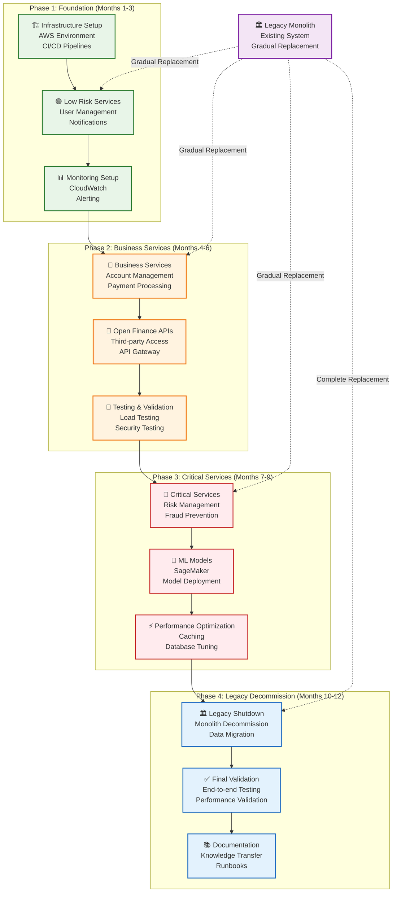
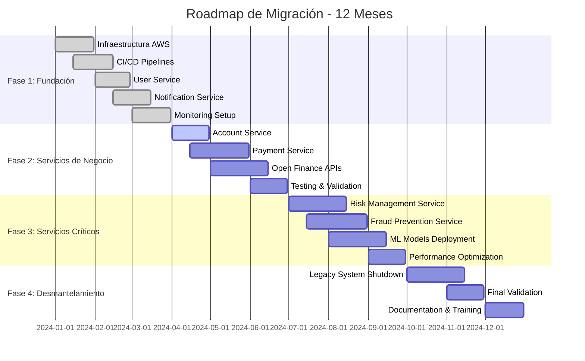
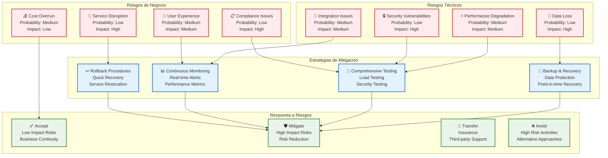

# Roadmap de Migración - Strangler Fig Pattern

## Descripción

Este documento detalla el **plan de migración gradual** del sistema bancario monolítico a una arquitectura de microservicios, utilizando el patrón Strangler Fig para minimizar riesgos operativos.

## 1. Estrategia de Migración (Strangler Fig Pattern)



## 2. Timeline de Migración



## 3. Fases Detalladas de Migración

### 3.1 Fase 1: Fundación (Meses 1-3)

#### Objetivos
- Establecer infraestructura AWS
- Implementar CI/CD pipelines
- Migrar servicios de bajo riesgo
- Configurar monitoreo

#### Actividades

##### Mes 1: Infraestructura
```yaml
infrastructure:
  - Setup AWS accounts and organizations
  - Configure VPC, subnets, security groups
  - Setup IAM roles and policies
  - Configure CloudWatch and logging
  - Setup Route 53 and load balancers
```

##### Mes 2: CI/CD y Servicios Básicos
```yaml
cicd_services:
  - Setup GitHub Actions or Jenkins
  - Configure Docker registries
  - Implement User Service
  - Setup notification infrastructure
  - Configure monitoring dashboards
```

##### Mes 3: Monitoreo y Validación
```yaml
monitoring_validation:
  - Setup comprehensive monitoring
  - Implement alerting systems
  - Performance testing
  - Security validation
  - Documentation
```

#### Criterios de Éxito
- ✅ Infraestructura AWS funcionando
- ✅ CI/CD pipelines operativos
- ✅ User Service en producción
- ✅ Monitoreo completo implementado
- ✅ 99.9% uptime mantenido

### 3.2 Fase 2: Servicios de Negocio (Meses 4-6)

#### Objetivos
- Migrar servicios de negocio críticos
- Implementar Open Finance APIs
- Validar integración con legacy
- Testing exhaustivo

#### Actividades

##### Mes 4: Account Service
```yaml
account_service:
  - Design account service architecture
  - Implement account management APIs
  - Setup database migration
  - Configure data synchronization
  - Implement testing
```

##### Mes 5: Payment Service
```yaml
payment_service:
  - Implement payment processing
  - Setup PSP integrations
  - Configure multi-tenant architecture
  - Implement webhook handling
  - Setup payment reconciliation
```

##### Mes 6: Open Finance y Testing
```yaml
open_finance_testing:
  - Implement Open Finance APIs
  - Setup OAuth 2.0 authentication
  - Configure rate limiting
  - Comprehensive testing
  - Performance validation
```

#### Criterios de Éxito
- ✅ Account Service funcionando
- ✅ Payment Service operativo
- ✅ Open Finance APIs disponibles
- ✅ 50% de tráfico en microservicios
- ✅ Testing completo validado

### 3.3 Fase 3: Servicios Críticos (Meses 7-9)

#### Objetivos
- Migrar servicios críticos
- Implementar modelos ML
- Optimizar performance
- Preparar desmantelamiento

#### Actividades

##### Mes 7: Risk Management
```yaml
risk_management:
  - Implement risk assessment engine
  - Setup ML model integration
  - Configure real-time processing
  - Implement risk monitoring
  - Setup risk reporting
```

##### Mes 8: Fraud Prevention
```yaml
fraud_prevention:
  - Implement fraud detection
  - Setup behavioral analysis
  - Configure device fingerprinting
  - Implement fraud investigation
  - Setup fraud reporting
```

##### Mes 9: ML Models y Optimización
```yaml
ml_optimization:
  - Deploy ML models to production
  - Optimize database performance
  - Implement caching strategies
  - Setup auto-scaling
  - Performance tuning
```

#### Criterios de Éxito
- ✅ Risk Service funcionando
- ✅ Fraud Service operativo
- ✅ ML models en producción
- ✅ 90% de tráfico en microservicios
- ✅ Performance optimizada

### 3.4 Fase 4: Desmantelamiento (Meses 10-12)

#### Objetivos
- Desmantelar sistema legacy
- Validación final
- Documentación completa
- Transferencia de conocimiento

#### Actividades

##### Mes 10: Legacy Shutdown
```yaml
legacy_shutdown:
  - Migrate remaining data
  - Shutdown legacy services
  - Update DNS records
  - Decommission legacy infrastructure
  - Archive legacy data
```

##### Mes 11: Validación Final
```yaml
final_validation:
  - End-to-end testing
  - Performance validation
  - Security audit
  - Compliance verification
  - User acceptance testing
```

##### Mes 12: Documentación
```yaml
documentation:
  - Complete system documentation
  - Create runbooks
  - Knowledge transfer sessions
  - Training materials
  - Post-migration review
```

#### Criterios de Éxito
- ✅ Legacy system desmantelado
- ✅ 100% de tráfico en microservicios
- ✅ Documentación completa
- ✅ Team entrenado
- ✅ Proyecto completado

## 4. Gestión de Riesgos de Migración



### Matriz de Riesgos

| Riesgo | Probabilidad | Impacto | Mitigación | Responsable |
|--------|--------------|---------|------------|-------------|
| **Pérdida de Datos** | Baja | Alto | Backup automático, testing | DBA Team |
| **Degradación Performance** | Media | Media | Load testing, monitoring | DevOps Team |
| **Problemas de Integración** | Media | Media | Testing exhaustivo | Dev Team |
| **Vulnerabilidades Seguridad** | Baja | Alto | Security testing | Security Team |
| **Interrupción Servicio** | Baja | Alto | Rollback procedures | SRE Team |
| **Problemas Compliance** | Baja | Alto | Audit continuo | Compliance Team |
| **Experiencia Usuario** | Media | Media | UAT, feedback | Product Team |
| **Sobre costo** | Media | Baja | Budget monitoring | PM Team |

## 5. Estrategias de Mitigación

### 5.1 Backup y Recovery

#### Estrategia de Backup
```yaml
backup_strategy:
  continuous:
    - Real-time replication
    - Cross-region sync
    - Point-in-time recovery
    
  scheduled:
    - Daily snapshots
    - Weekly full backups
    - Monthly archives
    
  testing:
    - Monthly restore tests
    - Quarterly DR drills
    - Annual full recovery test
```

### 5.2 Testing Comprehensivo

#### Estrategia de Testing
```yaml
testing_strategy:
  unit_tests:
    - Code coverage > 80%
    - Automated testing
    - Continuous integration
    
  integration_tests:
    - API testing
    - Database testing
    - External service testing
    
  performance_tests:
    - Load testing
    - Stress testing
    - Endurance testing
    
  security_tests:
    - Penetration testing
    - Vulnerability scanning
    - Code security analysis
```

### 5.3 Monitoreo Continuo

#### Estrategia de Monitoreo
```yaml
monitoring_strategy:
  metrics:
    - Application metrics
    - Infrastructure metrics
    - Business metrics
    
  alerts:
    - Real-time alerts
    - Escalation procedures
    - On-call rotation
    
  dashboards:
    - Executive dashboards
    - Operational dashboards
    - Development dashboards
```

## 6. Plan de Comunicación

### 6.1 Stakeholders

| Stakeholder | Frecuencia | Canal | Contenido |
|-------------|------------|-------|-----------|
| **C-Level** | Semanal | Email + Meeting | Status, riesgos, decisiones |
| **Business Users** | Quincenal | Newsletter | Funcionalidades, training |
| **IT Team** | Diario | Slack + Meeting | Progress, issues, tasks |
| **External Partners** | Mensual | Email | API changes, integration |

### 6.2 Comunicación de Cambios

#### Template de Comunicación
```yaml
change_communication:
  template:
    subject: "Migration Update - Phase {phase}"
    content:
      - Current status
      - Completed activities
      - Upcoming milestones
      - Risks and mitigation
      - Next steps
      
  channels:
    - Email notifications
    - Slack updates
    - Team meetings
    - Status page
```

## 7. Métricas de Éxito

### 7.1 KPIs Técnicos

| Métrica | Baseline | Target | Medición |
|---------|----------|--------|----------|
| **Uptime** | 99.5% | 99.99% | CloudWatch |
| **Response Time** | 500ms | 200ms | APM Tools |
| **Error Rate** | 0.1% | 0.01% | Log Analysis |
| **Deployment Frequency** | Weekly | Daily | CI/CD Metrics |
| **Recovery Time** | 4 hours | 1 hour | Incident Logs |

### 7.2 KPIs de Negocio

| Métrica | Baseline | Target | Medición |
|---------|----------|--------|----------|
| **Customer Satisfaction** | 4.2/5 | 4.8/5 | Surveys |
| **Time to Market** | 3 months | 1 month | Feature Delivery |
| **Operational Costs** | $100K/month | $60K/month | Budget Tracking |
| **Developer Productivity** | 80% | 95% | Velocity Metrics |
| **Compliance Score** | 85% | 100% | Audit Results |

## 8. Post-Migración

### 8.1 Actividades Post-Migración

```yaml
post_migration:
  immediate:
    - Monitor system stability
    - Address any issues
    - Collect feedback
    - Document lessons learned
    
  short_term:
    - Performance optimization
    - Cost optimization
    - Team training
    - Process improvement
    
  long_term:
    - Continuous improvement
    - Technology updates
    - Feature development
    - Strategic planning
```

### 8.2 Lecciones Aprendidas

#### Template de Lecciones Aprendidas
```yaml
lessons_learned:
  what_went_well:
    - Successful activities
    - Effective strategies
    - Positive outcomes
    
  what_could_improve:
    - Challenges faced
    - Areas for improvement
    - Process gaps
    
  recommendations:
    - Future improvements
    - Best practices
    - Process changes
```

## Beneficios de la Estrategia de Migración

### ✅ **Riesgo Reducido**
- Migración gradual
- Rollback procedures
- Testing exhaustivo
- Monitoreo continuo

### ✅ **Continuidad del Negocio**
- Zero downtime
- Service continuity
- User experience maintained
- Compliance preserved

### ✅ **Calidad Mejorada**
- Modern architecture
- Better performance
- Enhanced security
- Improved scalability

### ✅ **Eficiencia Operacional**
- Reduced costs
- Faster deployments
- Better monitoring
- Improved productivity

---

**Documento**: Roadmap de Migración  
**Versión**: 1.0  
**Fecha**: Diciembre 2024


