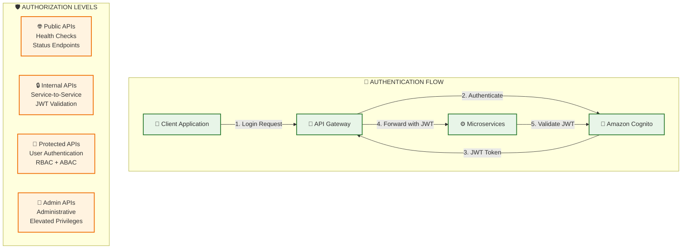

# 🚀 **DISEÑO DE APIs INTERNAS - OVERVIEW**

## 📋 **ÍNDICE**

1. [Arquitectura de APIs](#arquitectura-de-apis)
2. [Estándares y Convenciones](#estándares-y-convenciones)
3. [Diagrama de APIs](#diagrama-de-apis)
4. [Microservicios y sus APIs](#microservicios-y-sus-apis)
5. [Patrones de Diseño](#patrones-de-diseño)
6. [Seguridad y Autenticación](#seguridad-y-autenticación)
7. [Versionado y Evolución](#versionado-y-evolución)

---

## 🏗️ **ARQUITECTURA DE APIs**

### **Principios de Diseño**

```yaml
principios_api:
  restful: "APIs RESTful siguiendo estándares HTTP"
  stateless: "APIs stateless para escalabilidad"
  versionado: "Versionado semántico (v1, v2, etc.)"
  documentacion: "Documentación OpenAPI 3.0"
  testing: "Testing automatizado con contratos"
  observabilidad: "Logging y métricas integradas"
```

### **Stack Tecnológico**

| Componente | Tecnología | Justificación |
|------------|------------|---------------|
| **API Gateway** | AWS API Gateway | Punto de entrada único, rate limiting |
| **Documentación** | OpenAPI 3.0 + Swagger | Estándar industria, auto-generación |
| **Testing** | Postman + Newman | Testing automatizado de contratos |
| **Monitoreo** | CloudWatch + X-Ray | Observabilidad completa |
| **Seguridad** | OAuth 2.0 + JWT | Autenticación estándar |

---

## 📊 **DIAGRAMA DE APIs INTERNAS**

```mermaid
graph TB
    %% API Gateway Layer
    subgraph "🚪 API GATEWAY LAYER"
        Gateway[🚪 AWS API Gateway<br/>• Rate Limiting<br/>• Authentication<br/>• Routing<br/>• Monitoring]
    end
    
    %% Core APIs
    subgraph "⚙️ CORE MICROSERVICES APIs"
        UserAPI[👤 User Service API<br/>/api/v1/users<br/>• CRUD Operations<br/>• Profile Management<br/>• Authentication]
        
        AccountAPI[💰 Account Service API<br/>/api/v1/accounts<br/>• Account Operations<br/>• Balance Management<br/>• Transaction History]
        
        PaymentAPI[💳 Payment Service API<br/>/api/v1/payments<br/>• Payment Processing<br/>• PSP Integration<br/>• Multi-tenant]
        
        RiskAPI[⚠️ Risk Service API<br/>/api/v1/risk<br/>• Risk Assessment<br/>• ML Integration<br/>• Real-time Scoring]
        
        FraudAPI[🛡️ Fraud Service API<br/>/api/v1/fraud<br/>• Fraud Detection<br/>• Pattern Analysis<br/>• Behavioral Analytics]
        
        NotificationAPI[📧 Notification API<br/>/api/v1/notifications<br/>• Multi-channel<br/>• Template Management<br/>• Delivery Tracking]
    end
    
    %% Open Finance APIs
    subgraph "🔌 OPEN FINANCE APIs"
        OpenFinanceAPI[🔌 Open Finance API<br/>/api/v1/openfinance<br/>• Third-party Access<br/>• Consent Management<br/>• Data Aggregation]
        
        ConsentAPI[📋 Consent Management API<br/>/api/v1/consent<br/>• Consent Creation<br/>• Consent Revocation<br/>• Consent Status]
    end
    
    %% Internal Communication
    subgraph "🔄 INTERNAL COMMUNICATION"
        EventAPI[📨 Event API<br/>Internal Events<br/>• Payment Events<br/>• Risk Events<br/>• Fraud Events]
        
        HealthAPI[💚 Health Check API<br/>/health<br/>• Service Status<br/>• Dependencies<br/>• Metrics]
    end
    
    %% External Integrations
    subgraph "🔗 EXTERNAL INTEGRATIONS"
        PSPAPI[💳 PSP Integration APIs<br/>• BTG API<br/>• TotalCoin API<br/>• MercadoPago API<br/>• AstroPay API]
        
        LegacyAPI[🏛️ Legacy Integration API<br/>• Core Banking<br/>• Account System<br/>• Transaction System]
    end
    
    %% Connections
    Gateway --> UserAPI
    Gateway --> AccountAPI
    Gateway --> PaymentAPI
    Gateway --> RiskAPI
    Gateway --> FraudAPI
    Gateway --> NotificationAPI
    Gateway --> OpenFinanceAPI
    Gateway --> ConsentAPI
    
    %% Internal Communication
    PaymentAPI --> EventAPI
    RiskAPI --> EventAPI
    FraudAPI --> EventAPI
    
    UserAPI --> HealthAPI
    AccountAPI --> HealthAPI
    PaymentAPI --> HealthAPI
    
    %% External Integrations
    PaymentAPI --> PSPAPI
    AccountAPI --> LegacyAPI
    PaymentAPI --> LegacyAPI
    
    %% Styling
    classDef gateway fill:#fff3e0,stroke:#ef6c00,stroke-width:3px
    classDef core fill:#f3e5f5,stroke:#7b1fa2,stroke-width:2px
    classDef openfinance fill:#e8eaf6,stroke:#3f51b5,stroke-width:2px
    classDef internal fill:#e1f5fe,stroke:#0277bd,stroke-width:2px
    classDef external fill:#ffebee,stroke:#c62828,stroke-width:2px
    
    class Gateway gateway
    class UserAPI,AccountAPI,PaymentAPI,RiskAPI,FraudAPI,NotificationAPI core
    class OpenFinanceAPI,ConsentAPI openfinance
    class EventAPI,HealthAPI internal
    class PSPAPI,LegacyAPI external
```



---

## 🎯 **MICROSERVICIOS Y SUS APIs**

### **1. User Service API**
- **Base URL**: `/api/v1/users`
- **Responsabilidades**: Gestión de usuarios, autenticación, perfiles
- **Endpoints**: 15+ endpoints para CRUD y operaciones específicas

### **2. Account Service API**
- **Base URL**: `/api/v1/accounts`
- **Responsabilidades**: Gestión de cuentas, balances, historial
- **Endpoints**: 20+ endpoints para operaciones bancarias

### **3. Payment Service API**
- **Base URL**: `/api/v1/payments`
- **Responsabilidades**: Procesamiento de pagos, integración PSP
- **Endpoints**: 25+ endpoints para pagos y transacciones

### **4. Risk Service API**
- **Base URL**: `/api/v1/risk`
- **Responsabilidades**: Evaluación de riesgo, scoring ML
- **Endpoints**: 10+ endpoints para análisis de riesgo

### **5. Fraud Service API**
- **Base URL**: `/api/v1/fraud`
- **Responsabilidades**: Detección de fraude, análisis comportamental
- **Endpoints**: 12+ endpoints para prevención de fraude

### **6. Notification Service API**
- **Base URL**: `/api/v1/notifications`
- **Responsabilidades**: Notificaciones multi-canal
- **Endpoints**: 8+ endpoints para gestión de notificaciones

---

## 🔒 **SEGURIDAD Y AUTENTICACIÓN**

### **Estrategia de Autenticación**



---

## 📈 **PATRONES DE DISEÑO**

### **1. API Gateway Pattern**
- **Punto de entrada único** para todas las APIs
- **Rate limiting** por tenant y usuario
- **Autenticación centralizada** con OAuth 2.0
- **Routing inteligente** basado en headers

### **2. Circuit Breaker Pattern**
- **Resilencia** para llamadas entre servicios
- **Fallback mechanisms** para servicios críticos
- **Timeout management** configurable
- **Health check integration**

### **3. Event-Driven Pattern**
- **Comunicación asíncrona** entre servicios
- **Event sourcing** para auditoría
- **CQRS** para separación de lecturas/escrituras
- **Kafka integration** para eventos

### **4. Multi-tenant Pattern**
- **Tenant isolation** en nivel de datos
- **Configuración por tenant** en APIs
- **Rate limiting** diferenciado
- **Billing separation** por tenant

---

## 📚 **PRÓXIMOS DOCUMENTOS**

Este overview se complementa con documentos detallados:

1. **`API_SPECIFICATIONS.md`** - Especificaciones detalladas de cada API
2. **`API_EXAMPLES.md`** - Ejemplos de uso y código
3. **`API_TESTING.md`** - Estrategias de testing y contratos
4. **`API_GOVERNANCE.md`** - Gobierno y mejores prácticas

---

**Este documento proporciona la visión general del diseño de APIs internas. Los documentos complementarios contienen los detalles específicos de implementación.**
