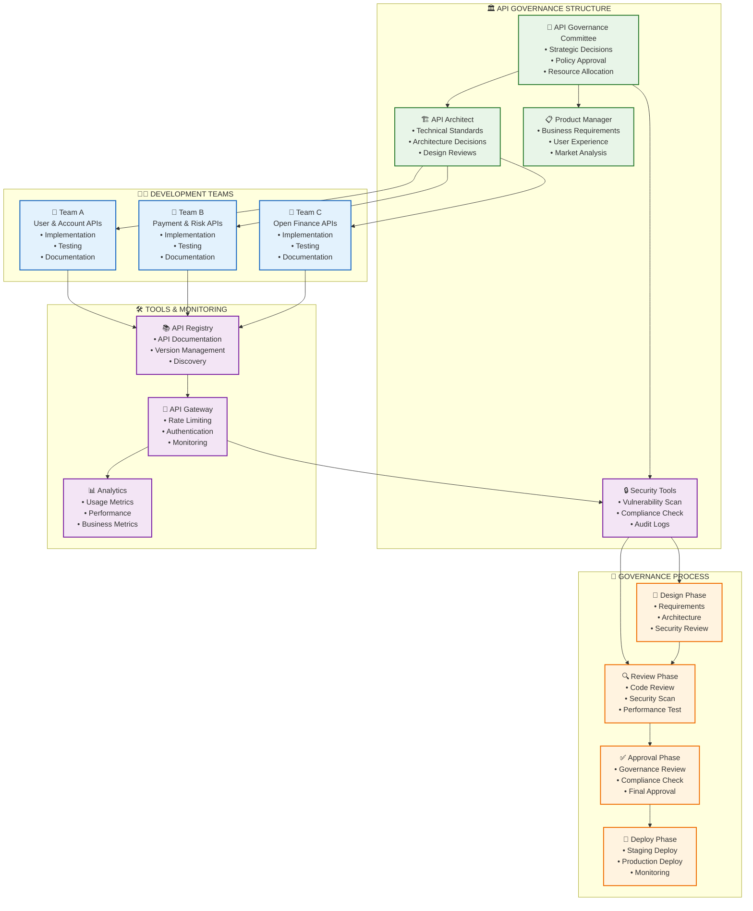
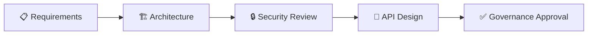
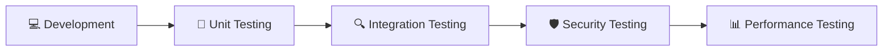
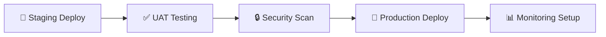

# 🏛️ **GOBIERNO DE APIs - FRAMEWORK COMPLETO**

## 📋 **ÍNDICE**

1. [Visión General](#visión-general)
2. [Políticas y Estándares](#políticas-y-estándares)
3. [Organización y Roles](#organización-y-roles)
4. [Proceso de Gobierno](#proceso-de-gobierno)
5. [Herramientas y Métricas](#herramientas-y-métricas)
6. [Cumplimiento y Auditoría](#cumplimiento-y-auditoría)

---

## 🎯 **VISIÓN GENERAL**

### **Objetivos del Gobierno de API**

```yaml
objetivos:
  calidad: "Garantizar calidad y consistencia de APIs"
  seguridad: "Asegurar cumplimiento de políticas de seguridad"
  escalabilidad: "Facilitar escalabilidad y mantenimiento"
  innovacion: "Acelerar innovación con APIs reutilizables"
  cumplimiento: "Cumplir regulaciones bancarias y PCI DSS"
```

### **Beneficios Esperados**

- **Consistencia**: APIs uniformes y predecibles
- **Seguridad**: Cumplimiento regulatorio garantizado
- **Eficiencia**: Desarrollo 40% más rápido
- **Calidad**: Reducción 60% en bugs de integración
- **Reutilización**: 80% de componentes compartidos

---

## 📊 **DIAGRAMA DE GOBIERNO**



---

## 📋 **POLÍTICAS Y ESTÁNDARES**

### **1. Estándares de Diseño**

| Estándar | Descripción | Cumplimiento |
|----------|-------------|--------------|
| **RESTful** | APIs RESTful siguiendo HTTP | Obligatorio |
| **OpenAPI 3.0** | Documentación estándar | Obligatorio |
| **JSON** | Formato de datos JSON | Obligatorio |
| **Versionado** | Versionado semántico (v1, v2) | Obligatorio |
| **Paginación** | Paginación estándar | Obligatorio |
| **Error Handling** | Manejo consistente de errores | Obligatorio |

### **2. Estándares de Seguridad**

```yaml
seguridad:
  autenticacion: "OAuth 2.0 + JWT obligatorio"
  autorizacion: "RBAC + ABAC implementado"
  encriptacion: "TLS 1.3 en tránsito, AES-256 en reposo"
  rate_limiting: "Rate limiting por tenant y usuario"
  logging: "Audit logs completos para todas las operaciones"
  compliance: "PCI DSS Level 1 + regulaciones bancarias"
```

### **3. Estándares de Performance**

```yaml
performance:
  latencia: "P95 < 200ms para APIs críticas"
  throughput: "Mínimo 1000 TPS por API"
  disponibilidad: "99.99% SLA garantizado"
  escalabilidad: "Auto-scaling basado en métricas"
  caching: "Caching estratégico implementado"
```

---

## 👥 **ORGANIZACIÓN Y ROLES**

### **API Governance Committee**

```yaml
committee:
  presidente: "CTO o VP Engineering"
  miembros:
    - "API Architect (Líder técnico)"
    - "Security Officer (Cumplimiento)"
    - "Product Manager (Negocio)"
    - "DevOps Lead (Operaciones)"
    - "QA Lead (Calidad)"
  
  responsabilidades:
    - "Aprobar políticas y estándares"
    - "Resolver conflictos entre equipos"
    - "Asignar recursos y prioridades"
    - "Revisar métricas y KPIs"
```

### **Roles Específicos**

| Rol | Responsabilidades | Nivel |
|-----|------------------|-------|
| **API Architect** | Diseño técnico, estándares, arquitectura | Senior |
| **Security Officer** | Políticas de seguridad, cumplimiento | Senior |
| **API Developer** | Implementación, testing, documentación | Mid-Senior |
| **API Tester** | Testing automatizado, contratos | Mid |
| **DevOps Engineer** | Despliegue, monitoreo, operaciones | Senior |

---

## 🔄 **PROCESO DE GOBIERNO**

### **Fase 1: Diseño y Planificación**



### **Fase 2: Desarrollo y Testing**



### **Fase 3: Despliegue y Monitoreo**



---

## 🛠️ **HERRAMIENTAS Y MÉTRICAS**

### **Herramientas de Gobierno**

| Categoría | Herramienta | Propósito |
|-----------|-------------|-----------|
| **Registry** | AWS API Gateway | Documentación y discovery |
| **Testing** | Postman + Newman | Testing automatizado |
| **Security** | AWS WAF + GuardDuty | Protección y monitoreo |
| **Analytics** | CloudWatch + X-Ray | Métricas y observabilidad |
| **Documentation** | Swagger/OpenAPI | Documentación estándar |

### **Métricas de Gobierno**

```yaml
metricas:
  calidad:
    - "API Documentation Coverage: >95%"
    - "Test Coverage: >90%"
    - "Security Scan Pass Rate: 100%"
    - "Performance SLA Compliance: >99%"
  
  adopcion:
    - "API Usage Growth: >20% trimestral"
    - "Developer Satisfaction: >4.5/5"
    - "Time to First Call: <2 horas"
    - "API Reuse Rate: >60%"
  
  operacional:
    - "API Availability: >99.99%"
    - "Mean Time to Recovery: <15 min"
    - "Deployment Success Rate: >95%"
    - "Incident Response Time: <5 min"
```

---

## 🔍 **CUMPLIMIENTO Y AUDITORÍA**

### **Auditorías Regulares**

```yaml
auditorias:
  mensual:
    - "Revisión de métricas de performance"
    - "Auditoría de seguridad de APIs"
    - "Revisión de documentación"
  
  trimestral:
    - "Auditoría de cumplimiento regulatorio"
    - "Revisión de políticas de gobierno"
    - "Evaluación de herramientas y procesos"
  
  anual:
    - "Auditoría externa de seguridad"
    - "Revisión completa de arquitectura"
    - "Evaluación de gobierno y procesos"
```

### **Checklist de Cumplimiento**

- ✅ **Documentación OpenAPI 3.0** completa
- ✅ **Autenticación OAuth 2.0** implementada
- ✅ **Rate limiting** configurado
- ✅ **Logging de auditoría** activo
- ✅ **Testing automatizado** >90% cobertura
- ✅ **Monitoreo y alertas** configurados
- ✅ **Cumplimiento PCI DSS** verificado
- ✅ **Versionado semántico** implementado

---

## 📈 **ROADMAP DE IMPLEMENTACIÓN**

### **Fase 1: Fundación (Mes 1-2)**
- Establecer API Governance Committee
- Definir políticas y estándares
- Implementar herramientas básicas

### **Fase 2: Adopción (Mes 3-4)**
- Capacitar equipos de desarrollo
- Implementar procesos de revisión
- Desplegar herramientas de monitoreo

### **Fase 3: Optimización (Mes 5-6)**
- Refinar métricas y KPIs
- Automatizar procesos de gobierno
- Implementar mejoras continuas

---

## 🎯 **BENEFICIOS ESPERADOS**

### **Técnicos**
- **Consistencia**: APIs uniformes y predecibles
- **Calidad**: Reducción 60% en bugs de integración
- **Seguridad**: Cumplimiento 100% regulatorio
- **Performance**: SLA 99.99% garantizado

### **De Negocio**
- **Time-to-Market**: Desarrollo 40% más rápido
- **Costos**: Reducción 30% en mantenimiento
- **Innovación**: 80% reutilización de componentes
- **Escalabilidad**: Soporte para 10x más transacciones

---

**Este framework de gobierno de API asegura la calidad, seguridad y escalabilidad de todas las APIs del sistema bancario.**
